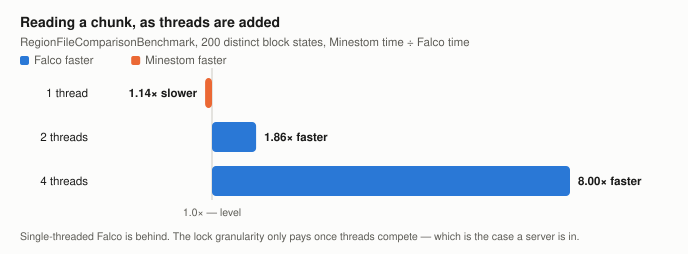
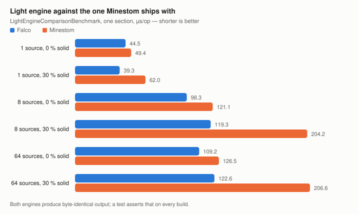
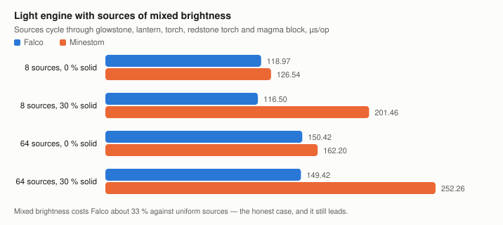
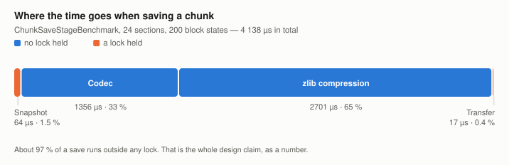

# Falco

A high-performance Anvil chunk loader and light engine for
[Minestom](https://github.com/Minestom/Minestom), plus an `Instance` implementation that cleans up
after itself.

The first two replace something the platform already ships, and both exist for the same reason: the
versions that come with the server serialise work that does not have to be serialised, and lose
information that should not be lost. The third replaces something that works, for a reason that has
nothing to do with speed — and it claims none.

| Module | What it is |
| --- | --- |
| `falco-anvil` | A `ChunkLoader` for the Anvil region format. Genuinely parallel — reading, decompression and NBT parsing do not share one lock. A read failure throws instead of silently reporting the chunk as absent, so the server cannot overwrite real data with a freshly generated chunk. Unknown blocks and biomes survive a load/save round trip. |
| `falco-light` | A block and sky light engine. Thread-safe per call and not tied to any chunk implementation — results are handed over through `Light#set`, so it works with chunk types Minestom's own engine ignores. Call it yourself, or hand the instance `setChunkSupplier(scheduler.supplier())` and `FalcoLightingChunk` keeps its own light up to date — the entry point Minestom's `LightingChunk` offers, on any `Instance`. |
| `falco-instance` | An `Instance` and its `Chunk`. **No speed gain is claimed and none is measured**: chunk and entity ticking lives in the global `ThreadDispatcher` of the server process, not in the instance, so replacing the instance cannot make ticking faster. What it buys is an unload path of its own — `InstanceManager.unregisterInstance` skips the cleanup for anything that is not an `InstanceContainer` and leaks every chunk the instance ever loaded — and an implementation small enough to read and test. It cannot back a `SharedInstance`, the block batches do not see it, and it runs no generator. |

## What "high-performance" means here

Measured, not asserted. Every figure below comes from a JMH benchmark in this repository; the
methodology is in [`docs/benchmarks.md`](docs/benchmarks.md), the full numbers in
[`STATUS.md`](STATUS.md). Expand a section for the chart and the table behind it.

<details>
<summary><b>Anvil loader as threads compete</b> — level on one thread, 8× on four</summary>

<br>

<picture>
  <source media="(prefers-color-scheme: dark)" srcset="docs/charts/loader-contention-dark.svg">
  
</picture>

Reading one chunk, 200 distinct block states, µs/op:

| Threads | Falco | Minestom | |
| ---: | ---: | ---: | --- |
| 1 | 1 203 ± 123 | 1 060 ± 55 | 1.14× **slower** |
| 2 | 1 181 ± 31 | 2 200 ± 445 | 1.86× faster |
| 4 | 1 378 ± 84 | 11 021 ± 16 470 | 8.00× faster |
| 8 | 2 438 ± 252 | 530 905 ± 1 928 261 | see below |

**Single-threaded, Falco is the slower one.** The three-stage pipeline costs something to set up, and
with no contention there is nothing to win back. From two threads on, the picture inverts, and it
keeps inverting: Falco's own time grows by a factor of two from one thread to eight, Minestom's by
a factor of five hundred.

The eight-thread row is **not a usable figure** — its error bar is nearly four times its mean.
What it does show is that Minestom's read time stops being predictable under load, which for a
server is worse than being slow. Falco's error bar stays at ten percent of its mean throughout.

**Writing is a tie** (1.00× to 1.05× either way, at every thread count). Both implementations take a
lock to allocate sectors and update the header, so there is nothing to gain there — and claiming
otherwise would be easy and wrong.

<sub>Measured on a 16-core machine, JMH with one fork, 3 warmup and 5 measurement iterations of 2 s.
One fork is few; treat the direction as solid and the exact factors as indicative.</sub>

</details>

<details>
<summary><b>Light engine against Minestom's</b> — 1.11× to 1.71× faster, byte-identical output</summary>

<br>

<picture>
  <source media="(prefers-color-scheme: dark)" srcset="docs/charts/light-engine-dark.svg">
  
</picture>

| Sources | Solid | Falco | Minestom | |
| ---: | ---: | ---: | ---: | --- |
| 1 | 0 % | 44.5 ± 0.6 | 49.4 ± 1.3 | 1.11× faster |
| 1 | 30 % | 39.3 ± 0.8 | 62.0 ± 2.0 | 1.58× faster |
| 8 | 0 % | 98.3 ± 2.4 | 121.1 ± 5.5 | 1.23× faster |
| 8 | 30 % | 119.3 ± 3.5 | 204.2 ± 3.7 | **1.71× faster** |
| 64 | 0 % | 109.2 ± 1.6 | 126.5 ± 5.6 | 1.16× faster |
| 64 | 30 % | 122.6 ± 1.3 | 206.6 ± 4.2 | 1.68× faster |

The lead grows exactly where a real world is hardest — with solid blocks in the section, which is
every chunk that is not open sky. Both engines produce the same bytes, and
`LightEngineEquivalenceTest` asserts that on every build, so this is not speed bought with accuracy.

</details>

<details>
<summary><b>The same, with sources of mixed brightness</b> — the honest case</summary>

<br>

<picture>
  <source media="(prefers-color-scheme: dark)" srcset="docs/charts/light-engine-mixed-dark.svg">
  
</picture>

| Sources | Solid | Falco | Minestom | |
| ---: | ---: | ---: | ---: | --- |
| 8 | 0 % | 118.97 ± 8.89 | 126.54 ± 9.55 | 1.06× faster |
| 8 | 30 % | 116.50 ± 7.63 | 201.46 ± 16.83 | 1.73× faster |
| 64 | 0 % | 150.42 ± 32.73 | 162.20 ± 3.11 | 1.08× faster |
| 64 | 30 % | 149.42 ± 12.64 | 252.26 ± 9.28 | 1.69× faster |

Sources of differing brightness make a position get queued more than once, which costs Falco about
33 % against uniform sources and shrinks the lead in the open-sky rows to a few percent. It is
reported here rather than left out, because a benchmark that only shows its best case is worth
nothing.

</details>

<details>
<summary><b>Where a save spends its time</b> — 97 % of it outside any lock</summary>

<br>

<picture>
  <source media="(prefers-color-scheme: dark)" srcset="docs/charts/save-stages-dark.svg">
  
</picture>

| Stage | Time | Lock held |
| --- | ---: | --- |
| Snapshot | 64 µs | the read lock of the chunk |
| Codec, without compression | 1 356 µs | none |
| zlib compression | 2 701 µs | none |
| Transfer | 17 µs | the region lock |

This is the design claim as a number. Minestom's `RegionFile` reports
`supportsParallelLoading() == true` but serialises reading, decompression **and** NBT parsing
through a single `ReentrantLock`, so its parallelism is largely nominal. Moving that work out of the
lock is what the three-stage pipeline is for. Compression being 63 % of a save is also what made it
the optimisation target: at zlib level 2 it runs **1.83× faster** for about 3 % more bytes.

</details>

<details>
<summary><b>Two fast paths worth 51× and 76×</b></summary>

<br>

A section of pure air or pure stone carries a palette of one entry, and the majority of every world
looks like that. Detecting the case up front rather than walking 4 096 blocks:

| Fast path for a uniform section | Before | After | |
| --- | ---: | ---: | --- |
| Palette encode | 27.9 µs | 0.54 µs | **51×** |
| Opacity table | 40.8 µs | 0.54 µs | **76×**, and no arrays allocated |

</details>

Where an idea did **not** pay off, that is written down too — see the rejected optimisations in
`STATUS.md`, including the bucket queue that loses 5–7 % at equal source brightness.

All three modules are **experimental**. Every public type carries `@ApiStatus.Experimental`;
signatures and behaviour may still change in a minor release.

## Quick start

From nothing to a server that serves a stored world, in four steps. The last one needs no client.

### 1. Declare the dependency

Minestom is `compileOnly` in Falco, so it does not arrive with these artefacts — declare the version
you intend to run yourself.

```kotlin
repositories {
    mavenCentral()
    maven("https://repo.onelitefeather.dev/releases")
}

dependencies {
    implementation("net.onelitefeather:falco-anvil:0.2.1")
    implementation("net.onelitefeather:falco-light:0.2.1")

    // Falco declares no version for this one, on purpose. You pick it.
    implementation("net.minestom:minestom:<version>")
}
```

Maven, snapshots and the third module are in [Using it](#using-it) below.

### 2. Write the server

```java
import net.minestom.server.MinecraftServer;
import net.minestom.server.coordinate.Pos;
import net.minestom.server.event.instance.InstanceChunkLoadEvent;
import net.minestom.server.event.player.AsyncPlayerConfigurationEvent;
import net.minestom.server.instance.InstanceContainer;
import net.minestom.server.world.DimensionType;
import net.onelitefeather.falco.anvil.FalcoAnvilLoader;
import net.onelitefeather.falco.light.ChunkLightService;

import java.io.IOException;
import java.io.UncheckedIOException;
import java.nio.file.Path;

public final class Bootstrap {

    public static void main(String[] args) {
        MinecraftServer server = MinecraftServer.init();

        InstanceContainer instance = MinecraftServer.getInstanceManager()
                .createInstanceContainer(DimensionType.OVERWORLD);

        // The world root, not worlds/lobby/region. The instance keeps the loader for as long as it
        // lives, so it is not closed here — that happens on shutdown, at the bottom.
        FalcoAnvilLoader loader = new FalcoAnvilLoader(Path.of("worlds", "lobby"), DimensionType.OVERWORLD.key());
        instance.setChunkLoader(loader);
        instance.enableAutoChunkLoad(true);

        // One service is enough. It keeps nothing between calls and may be used from any number of
        // threads, which is what lets the chunks around several players be lit at the same time.
        ChunkLightService lighting = new ChunkLightService();
        MinecraftServer.getGlobalEventHandler().addListener(InstanceChunkLoadEvent.class, event ->
                lighting.calculateWithNeighbours(event.getInstance(), event.getChunkX(), event.getChunkZ()));

        MinecraftServer.getGlobalEventHandler().addListener(AsyncPlayerConfigurationEvent.class, event -> {
            event.setSpawningInstance(instance);
            event.getPlayer().setRespawnPoint(new Pos(0, 64, 0));
        });

        MinecraftServer.getSchedulerManager().buildShutdownTask(() -> {
            instance.saveChunksToStorage().join();
            try {
                loader.close();
            } catch (IOException exception) {
                throw new UncheckedIOException(exception);
            }
        });

        server.start("0.0.0.0", 25565);
    }
}
```

The listener is the explicit route: you decide which chunks are lit and when. There is a shorter one
that needs no listener at all — `instance.setChunkSupplier(scheduler.supplier())`, in
[Using it](#using-it) below.

### 3. Put a world where the loader looks

`worlds/lobby/` is the **world root** — the directory that contains `region/`, or
`dimensions/<namespace>/<value>/region/` in the 26.1 layout. The loader resolves the dimension
directory first and falls back to the older one. Point it at `region/` itself and it will find
nothing. `level.dat` is not read, so a directory holding only region files is enough.

Run the class and connect to `localhost:25565`. Chunks are read as you walk, `close()` on shutdown
flushes every open region file and writes the summary line.

### 4. Check it without a client

The same two operations without a listener around them, on a chunk of your choosing:

```java
Chunk chunk = instance.loadChunk(0, 0).join();
lighting.calculate(chunk);

int level = lighting.blockLightAt(chunk, 8, 40, 8);
System.out.println("block light at 8/40/8 is " + level);
```

A non-zero level for a lit position means the loader read the chunk and the engine lit it.

One honest note about the lighting in both steps. If the region files already carry light, it
recomputes what is already stored, because loading applies the stored arrays and clears the update
flag — for a pre-lit world the engine is doing work nobody asked for. It earns its keep on worlds
without stored light and after blocks change at runtime. Which case is which is spelled out in
[`docs/light-engine.md`](docs/light-engine.md).

## Using it

The quick start above shows the short version. This section has the rest: Maven, snapshots, and the
module that has no release yet.

Both released modules are published to the OneLiteFeather Reposilite, which serves them without
authentication:

```kotlin
repositories {
    mavenCentral()
    maven("https://repo.onelitefeather.dev/releases")
}

dependencies {
    implementation("net.onelitefeather:falco-anvil:0.2.1")
    implementation("net.onelitefeather:falco-light:0.2.1")
}
```

`falco-instance` is **not on the release endpoint** — it has never been released, so there is no
coordinate there that would resolve. It exists only as a snapshot:

```kotlin
repositories {
    maven("https://repo.onelitefeather.dev/snapshots")
}

dependencies {
    // Written in the three-argument form on purpose: the README updater in renovate.json rewrites
    // the "group:name:version" form to the latest release, and this module does not have one.
    implementation("net.onelitefeather", "falco-instance", "0.2.2-SNAPSHOT")
}
```

<details>
<summary>Snapshots</summary>

Every push to `main` that does not cut a release publishes to a second endpoint, public in the same
way:

```kotlin
repositories {
    maven("https://repo.onelitefeather.dev/snapshots")
}
```

The coordinates stay the same; only the version changes. It is the released version with its patch
bumped and `-SNAPSHOT` appended — so while `0.2.1` is the latest release, the snapshot endpoint
serves `0.2.2-SNAPSHOT`. That version keeps moving as commits land, which is the point of it and
also the reason not to build a release of your own against it.

</details>

<details>
<summary>Maven</summary>

```xml
<repository>
  <id>onelitefeater-repository-releases</id>
  <name>OneLiteFeather Network Reposilite Repository</name>
  <url>https://repo.onelitefeather.dev/releases</url>
</repository>

<repository>
  <id>onelitefeater-repository-snapshots</id>
  <name>OneLiteFeather Network Reposilite Repository</name>
  <url>https://repo.onelitefeather.dev/snapshots</url>
  <snapshots>
    <enabled>true</enabled>
  </snapshots>
</repository>
```

</details>

The modules are independent — take one without the other if that is all you need. Minestom itself is
`compileOnly` here, so you keep control of the version you run.

```java
// The loader takes the world root, not the region directory, and stays alive with the instance.
FalcoAnvilLoader loader = new FalcoAnvilLoader(Path.of("worlds", "lobby"), DimensionType.OVERWORLD.key());

instance.setChunkLoader(loader);
instance.enableAutoChunkLoad(true);
```

```java
ChunkLightService lighting = new ChunkLightService();   // one is enough, it is safe to share

lighting.calculate(chunk);
int level = lighting.blockLightAt(chunk, 8, 40, 8);
```

The light engine works on any chunk, whichever loader produced it.

To let the light maintain itself instead, give the instance a chunk that reports its own changes.
One scheduler per instance, and there is nothing else to call:

```java
ChunkLightScheduler scheduler = new ChunkLightScheduler(new ChunkLightService());
instance.setChunkSupplier(scheduler.supplier());
```

`FalcoLightingChunk` marks itself and its eight neighbours when it is loaded and on every
`setBlock`; the scheduler collects the marked chunks once per tick, groups them into connected
areas, computes each area off the tick thread and sends the result to the players who are already
looking. It works with any instance that lets you set a chunk supplier, `InstanceContainer`
included. The rules it follows — area size, back pressure, the staleness check — are in the class
documentation of `ChunkLightScheduler`.

`falco-instance` replaces the instance rather than something inside it, so it is used at the point
where the world is created instead of being handed to one. The one call it asks you to remember is
the last:

```java
InstanceManager manager = MinecraftServer.getInstanceManager();
FalcoAnvilLoader loader = new FalcoAnvilLoader(Path.of("worlds", "arena"), DimensionType.OVERWORLD.key());

FalcoInstance instance = new FalcoInstance(UUID.randomUUID(), DimensionType.OVERWORLD, loader);
manager.registerInstance(instance);

// Not manager.unregisterInstance(instance): for anything that is not an InstanceContainer that one
// leaves every loaded chunk, its tick partition and its entities behind.
instance.unregister(manager);
```

A foreign instance has to be registered by hand, which is what `registerInstance` above does. The
chunk supplier stays at `FalcoChunk::new` — the lifecycle hooks a chunk needs to be marked unloaded
are `protected` in Minestom's own package, so any other chunk type is refused rather than accepted
and then left unloadable. What this instance will not do is generate: `setGenerator` throws instead
of storing a generator that nothing would call. A generated world stays with `InstanceContainer`,
and so does anything backing a `SharedInstance` or built through the block batches. The reasoning,
and the four places where Minestom quietly treats a foreign instance differently, are in
[`docs/rationale/instances-and-chunks.md`](docs/rationale/instances-and-chunks.md).

## Documentation

### What is built

- [`docs/anvil-chunk-loader.md`](docs/anvil-chunk-loader.md) — what the loader does, how to use it,
  and what it deliberately does not do
- [`docs/light-engine.md`](docs/light-engine.md) — the engine, its guarantees and its limits
- [`docs/benchmarks.md`](docs/benchmarks.md) — how it was measured and against what
- [`STATUS.md`](STATUS.md) — the state of the project and the findings that cost real effort to
  establish

### API documentation

The Reposilite that serves the artefacts renders their Javadoc as well, so every published version
has a page to read in the browser:

| Module | Rendered Javadoc |
| --- | --- |
| `falco-anvil` | [`falco-anvil` 0.2.1](https://repo.onelitefeather.dev/javadoc/releases/net/onelitefeather/falco-anvil/0.2.1) |
| `falco-light` | [`falco-light` 0.2.1](https://repo.onelitefeather.dev/javadoc/releases/net/onelitefeather/falco-light/0.2.1) |
| `falco-instance` | No release yet, so only the snapshot: [`falco-instance` 0.2.2-SNAPSHOT](https://repo.onelitefeather.dev/javadoc/snapshots/net/onelitefeather/falco-instance/0.2.2-SNAPSHOT) |

The address is built the same way for every module and every version:

```
https://repo.onelitefeather.dev/javadoc/<releases|snapshots>/net/onelitefeather/<module>/<version>
```

`latest` works in place of a version and follows the newest one on that endpoint. A version that was
never published to it answers 404 rather than showing something stale — `falco-instance` on
`releases` is exactly that case.

The same pages also travel with the artefacts, as the `-javadoc.jar` every published module carries
next to its main jar. That is the copy the IDE wants: with the dependency declared, *Download
Sources and Documentation* in IntelliJ IDEA — and the equivalent in Eclipse — fetches it from the
same repository and attaches it to the classes, which makes the documentation available offline and
inside the editor.

To build the pages from source instead:

```bash
./gradlew javadoc     # falco-<module>/build/docs/javadoc/index.html, one tree per module
```

That is a build of this project, so it needs the credentials described under
[Building](#building). Reading the rendered pages or downloading a javadoc jar needs none.

### Why it is built this way

- [`docs/rationale/`](docs/rationale/README.md) — the reasoning and the evidence behind the design:
  what each decision was weighed against, and where the argument is weaker than the numbers suggest

## Building

```bash
./gradlew build                      # compile, javadoc, tests
./gradlew :falco-benchmarks:jmhJar   # the benchmarks; a build never runs them
```

Java 25 is required.

**Building from source currently needs OneLiteFeather Maven credentials.** Falco compiles against
Minestom and the internal `mycelium-bom`, which are served from an authenticated endpoint, so
`./gradlew build` fails with a 401 without `ONELITEFEATHER_MAVEN_USERNAME` and
`ONELITEFEATHER_MAVEN_PASSWORD`. Consuming the published artefacts needs none of this — only
building the project itself does.

## Licence

AGPL-3.0. See [`LICENSE`](LICENSE).
