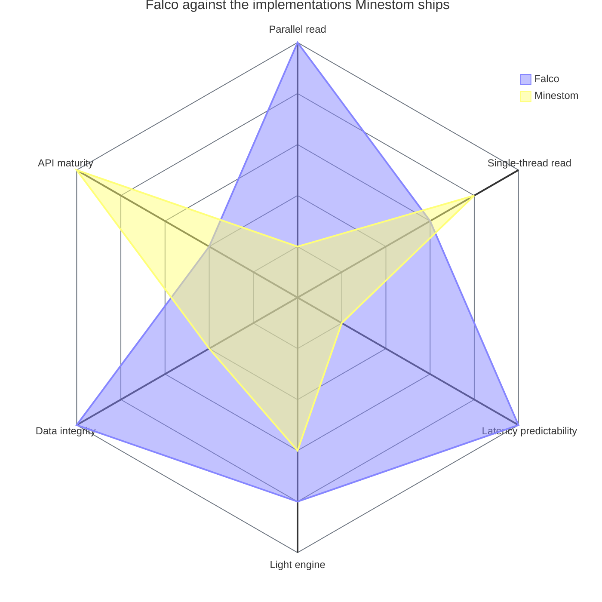

# Falco

A high-performance Anvil chunk loader and light engine for
[Minestom](https://github.com/Minestom/Minestom), plus an `Instance` implementation that cleans up
after itself.

The first two replace something the platform already ships, and both exist for the same reason: the
versions that come with the server serialise work that does not have to be serialised, and lose
information that should not be lost. The third replaces something that works, for a reason that has
nothing to do with speed — and it claims none.

| Module | What it is |
| --- | --- |
| `falco-anvil` | A `ChunkLoader` for the Anvil region format. Genuinely parallel — reading, decompression and NBT parsing do not share one lock. A read failure throws instead of silently reporting the chunk as absent, so the server cannot overwrite real data with a freshly generated chunk. Unknown blocks and biomes survive a load/save round trip. |
| `falco-light` | A block and sky light engine. Thread-safe per call and not tied to any chunk implementation — results are handed over through `Light#set`, so it works with chunk types Minestom's own engine ignores. Call it yourself, or hand the instance `setChunkSupplier(scheduler.supplier())` and `FalcoLightingChunk` keeps its own light up to date — the entry point Minestom's `LightingChunk` offers, on any `Instance`. |
| `falco-instance` | An `Instance` and its `Chunk`. **No speed gain is claimed and none is measured**: chunk and entity ticking lives in the global `ThreadDispatcher` of the server process, not in the instance, so replacing the instance cannot make ticking faster. What it buys is an unload path of its own — `InstanceManager.unregisterInstance` skips the cleanup for anything that is not an `InstanceContainer` and leaks every chunk the instance ever loaded — and an implementation small enough to read and test. It runs a generator, and more carefully than the original: the generator writes into clones of the chunk's palettes, so one that fails halfway leaves nothing behind rather than a half-built chunk that reports itself loaded. What it cannot do is back a `SharedInstance` — that is a compiler wall, not an omission. |

All three modules are **experimental**. Every public type carries `@ApiStatus.Experimental`;
signatures and behaviour may still change in a minor release.

- [Where it stands against Minestom](#where-it-stands-against-minestom) — the six axes, and the
  measurement behind each
- [Quick start](#quick-start) — from nothing to a server serving a stored world, in four steps
- [Installation](#installation) — the BOM, Maven, snapshots
- [Beyond the quick start](#beyond-the-quick-start) — self-maintaining light, and `falco-instance`
- [Documentation](#documentation) · [Building](#building) · [Licence](#licence)

## Where it stands against Minestom

Six axes, and Falco loses two of them.



| Axis | What it stands for | Who leads |
| --- | --- | --- |
| Parallel read | Two threads reading chunks: 1 181 ± 31 against 2 200 ± 445 µs/op | Falco, by 1.9× (1.45×–2.30×) |
| Single-thread read | One thread, no contention: 1 203 ± 123 against 1 060 ± 55 µs/op | **No difference resolvable** — the intervals overlap |
| Latency predictability | Spread of the read time under load: Falco's half-width stays near a tenth of its mean; Minestom's exceeds its own mean at four threads and is 3.6× it at eight | Falco |
| Light engine | 1.11× to 1.71× faster over six scenarios, every pair of intervals disjoint, byte-identical output | Falco |
| Data integrity | A read failure throws instead of reporting the chunk absent; unknown blocks and biomes survive a round trip | Falco |
| API maturity | Every Falco type is `@ApiStatus.Experimental`; `FalcoInstance` cannot back a `SharedInstance` and will not generate | **Minestom** |

**The 0–5 scale is an editorial ranking, not a measurement.** Ratios do not share a unit with "does
this API still change between releases", so no honest scale puts them on one axis — the chart is a
map of where to look, and the tables are the claim. One thing it cannot show at all: **writing
shows no resolvable difference at any thread count**, all four pairs of intervals overlapping,
because both implementations take a lock for the sector allocation and the header.

### The measurements behind it

Measured, not asserted. Every figure comes from a JMH benchmark in this repository; how it was
measured is in [Benchmarking](https://github.com/OneLiteFeatherNET/Falco/wiki/Benchmarking), why the
numbers are believable and what they do not license in
[Rationale: Measurement](https://github.com/OneLiteFeatherNET/Falco/wiki/Rationale-Measurement), and
the unabridged tables in
[Project Status](https://github.com/OneLiteFeatherNET/Falco/wiki/Project-Status).

The figure after a `±` is the half-width of a confidence interval over the measurement iterations of
one JVM launch, defined once
[in the wiki](https://github.com/OneLiteFeatherNET/Falco/wiki/Rationale-Measurement). Where two
intervals overlap, no factor is printed here, in either direction. Expand a section for the chart
and the table behind it.

<details>
<summary><b>Anvil loader as threads compete</b> — no difference resolvable on one thread, 1.9× faster on two, and beyond that Minestom's read time stops being predictable</summary>

<br>

<picture>
  <source media="(prefers-color-scheme: dark)" srcset="docs/charts/loader-contention-dark.svg">
  
</picture>

Reading one chunk, 200 distinct block states, µs/op:

| Threads | Falco | Minestom | |
| ---: | ---: | ---: | --- |
| 1 | 1 203 ± 123 | 1 060 ± 55 | intervals overlap — no difference resolvable |
| 2 | 1 181 ± 31 | 2 200 ± 445 | **1.9× faster** (1.45×–2.30×) |
| 4 | 1 378 ± 84 | 11 021 ± 16 470 | not usable as a factor — Minestom's ± is 1.5× its mean |
| 8 | 2 438 ± 252 | 530 905 ± 1 928 261 | not usable as a factor — Minestom's ± is 3.6× its mean |

**On one thread nothing is resolved, in either direction.** Falco's mean is the higher one — 1 203
against 1 060, which would be 14 % — but the intervals overlap at 1 080 to 1 115, so neither the
14 % nor a tie is established by this run. What the row does show is that the pipeline buys nothing
without contention, which is the expected result: the claim is about lock granularity, and with one
reader there is no lock to contend for.

**At two threads the picture inverts and the row carries it.** The intervals are disjoint, so the
difference stands. **The two-thread row did not reproduce, though, and that has to be said next to
it**: an independent run of the identical configuration, published in
[Anvil Chunk Loader](https://github.com/OneLiteFeatherNET/Falco/wiki/Anvil-Chunk-Loader), put
Minestom at 103 437 ± 856 306 µs/op at two threads — a half-width 8.3 times its own mean, which
carries no factor at all. Falco's two-thread figure did reproduce, at 1 174 ± 71 against the
1 181 ± 31 above. What survives both runs is the direction and the loss of predictability, not the
1.9×.

**At four and eight threads there is no factor to quote, and that is the finding.** Minestom's
half-width exceeds its own mean on both rows, which over a quantity that cannot be negative is not a
measurement of a duration but of a very long tail. The correct statement is qualitative and it is
worse for a server than being slow: under four and eight concurrent readers Minestom's read time
stops being predictable, while Falco's `±` stays at or below about a tenth of its own mean at every
thread count. The `8.00×` these rows used to be quoted at is withdrawn.

**Writing shows no resolvable difference at any thread count** — all four pairs of intervals
overlap. Both implementations take a lock to allocate sectors and update the header, which is why a
tie is the expected outcome; the numbers are consistent with it and do not by themselves prove
equality.

<sub>`RegionFileComparisonBenchmark.falcoRead` / `.minestomRead`, `distinctStates = 200`, one thread
count per row via `-t` so the four rows are four separate runs, one fork, 3 warmup and 5 measurement
iterations of 1 s per the class annotation — the published run's iteration time is not recorded —
JMH 1.37, one 16-core machine recorded as not idle, no `results.json` committed. One fork: the `±`
covers variance between iterations of one JVM, not between JVM launches. Full methodology and the
independent repeat:
[Benchmarking](https://github.com/OneLiteFeatherNET/Falco/wiki/Benchmarking).</sub>

</details>

<details>
<summary><b>Light engine against Minestom's</b> — 1.11× to 1.71× faster over six scenarios, every pair of intervals disjoint, byte-identical output</summary>

<br>

<picture>
  <source media="(prefers-color-scheme: dark)" srcset="docs/charts/light-engine-dark.svg">
  
</picture>

| Sources | Solid | Falco | Minestom | |
| ---: | ---: | ---: | ---: | --- |
| 1 | 0 % | 44.5 ± 0.6 | 49.4 ± 1.3 | 1.11× faster (1.07×–1.16×) |
| 1 | 30 % | 39.3 ± 0.8 | 62.0 ± 2.0 | 1.58× faster (1.50×–1.66×) |
| 8 | 0 % | 98.3 ± 2.4 | 121.1 ± 5.5 | 1.23× faster (1.15×–1.32×) |
| 8 | 30 % | 119.3 ± 3.5 | 204.2 ± 3.7 | **1.71× faster** (1.63×–1.80×) |
| 64 | 0 % | 109.2 ± 1.6 | 126.5 ± 5.6 | 1.16× faster (1.09×–1.23×) |
| 64 | 30 % | 122.6 ± 1.3 | 206.6 ± 4.2 | 1.68× faster (1.63×–1.74×) |

**All six pairs of intervals are disjoint, so all six rows stand as differences.** The lead grows
with occlusion: at one source it goes from 1.11× at 0 % solid to 1.58× at 30 %. `occlusionPercent`
is a benchmark parameter, not a survey of real worlds — the reason for measuring at 30 % is that
solid blocks end a search early, so an entirely open section is the upper bound of the work rather
than the typical case. Both engines produce the same bytes, and `LightEngineEquivalenceTest` asserts
that on every build over 54 scenarios, so this is not speed bought with accuracy.

<sub>`LightEngineComparisonBenchmark.falco` / `.minestom`, one section, `emissionMix = UNIFORM`,
`lightSources` and `occlusionPercent` as tabulated, one thread, run at `-f 1 -wi 5 -i 10` rather
than the class annotation's 3 and 5, JMH 1.37, one 16-core machine recorded as not idle, no
`results.json` committed, measured after commit `69381af`. One fork: the `±` covers variance between
iterations of one JVM, not between JVM launches. The table and its full reading:
[Light Engine](https://github.com/OneLiteFeatherNET/Falco/wiki/Light-Engine).</sub>

</details>

<details>
<summary><b>The same, with sources of mixed brightness</b> — the honest case, where two of the four rows resolve nothing</summary>

<br>

<picture>
  <source media="(prefers-color-scheme: dark)" srcset="docs/charts/light-engine-mixed-dark.svg">
  
</picture>

| Sources | Solid | Falco | Minestom | |
| ---: | ---: | ---: | ---: | --- |
| 8 | 0 % | 118.97 ± 8.89 | 126.54 ± 9.55 | intervals overlap — no difference resolvable |
| 8 | 30 % | 116.50 ± 7.63 | 201.46 ± 16.83 | 1.73× faster (1.49×–2.01×) |
| 64 | 0 % | 150.42 ± 32.73 | 162.20 ± 3.11 | intervals overlap — no difference resolvable |
| 64 | 30 % | 149.42 ± 12.64 | 252.26 ± 9.28 | 1.69× faster (1.50×–1.91×) |

Sources of differing brightness make a position get queued more than once. In the two open-sky rows
the difference does not resolve — the intervals overlap in both, and at 64 sources Falco's own `±`
is 22 % of its mean, the widest dispersion of any light row published. The two rows with solid
blocks do resolve and hold their lead. It is reported here rather than left out, because a benchmark
that only shows its best case is worth nothing.

<sub>`LightEngineComparisonBenchmark.falco` / `.minestom`, one section, `emissionMix = MIXED`,
`lightSources` 8 and 64, `occlusionPercent` 0 and 30, one thread, run at `-f 1 -wi 3 -i 5` — the
class annotation, and shorter than the `-i 10` of the table above, so the two tables are not
directly comparable — JMH 1.37, one 16-core machine recorded as not idle, no `results.json`
committed. One fork: the `±` covers variance between iterations of one JVM, not between JVM
launches. The full reading:
[Light Engine](https://github.com/OneLiteFeatherNET/Falco/wiki/Light-Engine).</sub>

</details>

<details>
<summary><b>Where a save spends its time</b> — 81 µs of a save is inside a lock, 4 057 µs is outside one</summary>

<br>

<picture>
  <source media="(prefers-color-scheme: dark)" srcset="docs/charts/save-stages-dark.svg">
  
</picture>

| Stage | Time | Lock held | Source |
| --- | ---: | --- | --- |
| Snapshot | 64 µs | the read lock of the chunk | `snapshot`, measured |
| Codec, without compression | 1 356 µs | none | `codecWithoutCompression`, measured |
| NBT serialisation and zlib compression | 2 701 µs | none | `codec` − `codecWithoutCompression`, **derived** |
| Transfer | 17 µs | the region lock | `transfer`, measured |

This is the design claim as a number. Minestom's `RegionFile` reports
`supportsParallelLoading() == true` but serialises reading, decompression **and** NBT parsing
through a single `ReentrantLock`, so its parallelism is largely nominal. Moving that work out of the
lock is what the three-stage pipeline is for. The rows carry no `±`, so this table supports an
ordering rather than a share: serialisation-and-compression is the largest stage, which is what made
it the optimisation target. Falco writes at zlib level 2 where Minestom writes at 6, a choice
recorded during design as faster for a few percent more stored bytes — no benchmark, interval or run
record was kept for it, so it is a design note rather than a result. The two percentages this block
used to print, and the level-2 figure, are discussed in
[Benchmarking](https://github.com/OneLiteFeatherNET/Falco/wiki/Benchmarking).

<sub>`ChunkSaveStageBenchmark`, a 24-section `ChunkColumn` of plain arrays, `distinctStates = 200`,
one thread, one fork, 5 warmup and 5 measurement iterations of 1 s per the class annotation — the
run's command line is not recorded — JMH 1.37, one 16-core machine recorded as not idle, no
`results.json` committed. **No `±` was published for any row**, so no ratio drawn from this table is
defensible beyond an order of magnitude.</sub>

</details>

<details>
<summary><b>The uniform-section fast paths</b> — a one-state section costs 51× and 76× less than a 200-state one</summary>

<br>

A section of pure air or pure stone carries a palette of one entry, and the majority of every world
looks like that. Detecting the case up front rather than walking 4 096 blocks:

| Fast path for a uniform section | General section, 200 states | Uniform section, 1 state | |
| --- | ---: | ---: | --- |
| Palette encode | 27.9 µs | 0.54 µs | **51×** cheaper |
| Opacity table | 40.8 µs | 0.54 µs | **76×** cheaper, and no arrays allocated |

<sub>These are two inputs to the same Falco code, not two versions of it, which is why the columns
are not headed Before and After. No benchmark class, parameters, machine, run configuration or `±`
was recorded for these four figures. Treat them as design-time orders of magnitude, not as results
of the benchmark suite —
[Benchmarking](https://github.com/OneLiteFeatherNET/Falco/wiki/Benchmarking) says what would be
needed to replace them.</sub>

</details>

Where an idea did **not** pay off, that is written down too — see the rejected optimisations in
[Project Status](https://github.com/OneLiteFeatherNET/Falco/wiki/Project-Status), including the
bucket queue that loses 5–7 % at equal source brightness.

## Quick start

From nothing to a server that serves a stored world, in four steps. The last one needs no client.

### 1. Declare the dependency

Minestom is `compileOnly` in Falco, so it does not arrive with these artefacts — declare the version
you intend to run yourself.

```kotlin
repositories {
    mavenCentral()
    maven("https://repo.onelitefeather.dev/releases")
}

dependencies {
    implementation("net.onelitefeather:falco-anvil:0.3.0")
    implementation("net.onelitefeather:falco-light:0.3.0")

    // Falco declares no version for this one, on purpose. You pick it.
    implementation("net.minestom:minestom:<version>")
}
```

Maven, snapshots, the third module and the BOM that pins all three are under
[Installation](#installation).

### 2. Write the server

```java
import net.minestom.server.MinecraftServer;
import net.minestom.server.coordinate.Pos;
import net.minestom.server.event.instance.InstanceChunkLoadEvent;
import net.minestom.server.event.player.AsyncPlayerConfigurationEvent;
import net.minestom.server.instance.InstanceContainer;
import net.minestom.server.world.DimensionType;
import net.onelitefeather.falco.anvil.FalcoAnvilLoader;
import net.onelitefeather.falco.light.ChunkLightService;

import java.io.IOException;
import java.io.UncheckedIOException;
import java.nio.file.Path;

public final class Bootstrap {

    public static void main(String[] args) {
        MinecraftServer server = MinecraftServer.init();

        InstanceContainer instance = MinecraftServer.getInstanceManager()
                .createInstanceContainer(DimensionType.OVERWORLD);

        // The world root, not worlds/lobby/region. The instance keeps the loader for as long as it
        // lives, so it is not closed here — that happens on shutdown, at the bottom.
        FalcoAnvilLoader loader = new FalcoAnvilLoader(Path.of("worlds", "lobby"), DimensionType.OVERWORLD.key());
        instance.setChunkLoader(loader);
        instance.enableAutoChunkLoad(true);

        // One service is enough. It keeps nothing between calls and may be used from any number of
        // threads, which is what lets the chunks around several players be lit at the same time.
        ChunkLightService lighting = new ChunkLightService();
        MinecraftServer.getGlobalEventHandler().addListener(InstanceChunkLoadEvent.class, event ->
                lighting.calculateWithNeighbours(event.getInstance(), event.getChunkX(), event.getChunkZ()));

        MinecraftServer.getGlobalEventHandler().addListener(AsyncPlayerConfigurationEvent.class, event -> {
            event.setSpawningInstance(instance);
            event.getPlayer().setRespawnPoint(new Pos(0, 64, 0));
        });

        MinecraftServer.getSchedulerManager().buildShutdownTask(() -> {
            instance.saveChunksToStorage().join();
            try {
                loader.close();
            } catch (IOException exception) {
                throw new UncheckedIOException(exception);
            }
        });

        server.start("0.0.0.0", 25565);
    }
}
```

The listener is the explicit route: you decide which chunks are lit and when. There is a shorter one
that needs no listener at all — `instance.setChunkSupplier(scheduler.supplier())`, under
[Beyond the quick start](#beyond-the-quick-start).

The modules are independent — take one without the other if that is all you need. The light engine
works on any chunk, whichever loader produced it.

### 3. Put a world where the loader looks

`worlds/lobby/` is the **world root** — the directory that contains `region/`, or
`dimensions/<namespace>/<value>/region/` in the 26.1 layout. The loader resolves the dimension
directory first and falls back to the older one. Point it at `region/` itself and it will find
nothing. `level.dat` is not read, so a directory holding only region files is enough.

Run the class and connect to `localhost:25565`. Chunks are read as you walk, `close()` on shutdown
flushes every open region file and writes the summary line.

### 4. Check it without a client

The same two operations without a listener around them, on a chunk of your choosing:

```java
Chunk chunk = instance.loadChunk(0, 0).join();
lighting.calculate(chunk);

int level = lighting.blockLightAt(chunk, 8, 40, 8);
System.out.println("block light at 8/40/8 is " + level);
```

A non-zero level for a lit position means the loader read the chunk and the engine lit it.

One honest note about the lighting in both steps. If the region files already carry light, it
recomputes what is already stored, because loading applies the stored arrays and clears the update
flag — for a pre-lit world the engine is doing work nobody asked for. It earns its keep on worlds
without stored light and after blocks change at runtime. Which case is which is spelled out in
[Light Engine](https://github.com/OneLiteFeatherNET/Falco/wiki/Light-Engine).

## Installation

All three modules are published to the OneLiteFeather Reposilite, which serves them without
authentication. Each carries its own version; the quick start above declares two of them, and the
third is `falco-instance`:

```kotlin
dependencies {
    implementation("net.onelitefeather:falco-anvil:0.3.0")
    implementation("net.onelitefeather:falco-light:0.3.0")
    implementation("net.onelitefeather:falco-instance:0.3.0")
}
```

There is a fourth artefact, `falco-bom`, whose only content is a version for each of the three
above. Imported as a platform it makes that version a single line, so the modules cannot drift apart
into a combination nobody tested — they are built and released together, and the BOM is what says so
to a build that consumes them:

```kotlin
dependencies {
    // Written in the three-argument form on purpose: the README updater in renovate.json rewrites
    // the "group:name:version" form to the latest release, and the BOM has no release yet.
    implementation(platform("net.onelitefeather", "falco-bom", "0.3.1-SNAPSHOT"))

    // No versions here — the platform above carries them. Take only the modules you need; a
    // platform constrains a version for each, it does not pull in one you did not declare.
    implementation("net.onelitefeather:falco-anvil")
    implementation("net.onelitefeather:falco-light")
    implementation("net.onelitefeather:falco-instance")
}
```

The BOM was added after `0.3.0` was cut, so the release endpoint does not serve it yet and the
snapshot coordinate above is the only one that resolves today. From the next release on it is a
normal coordinate like the others, and this snippet should lose the snapshot version along with the
comment explaining it.

<details>
<summary>Snapshots</summary>

Every push to `main` that does not cut a release publishes to a second endpoint, public in the same
way:

```kotlin
repositories {
    maven("https://repo.onelitefeather.dev/snapshots")
}
```

The coordinates stay the same; only the version changes. It is the released version with its patch
bumped and `-SNAPSHOT` appended — with `0.3.0` released, the snapshot endpoint serves
`0.3.1-SNAPSHOT`, which is what the BOM snippet above already assumes. That version keeps moving as
commits land, which is the point of it and also the reason not to build a release of your own
against it.

</details>

<details>
<summary>Maven</summary>

```xml
<repository>
  <id>onelitefeater-repository-releases</id>
  <name>OneLiteFeather Network Reposilite Repository</name>
  <url>https://repo.onelitefeather.dev/releases</url>
</repository>

<repository>
  <id>onelitefeater-repository-snapshots</id>
  <name>OneLiteFeather Network Reposilite Repository</name>
  <url>https://repo.onelitefeather.dev/snapshots</url>
  <snapshots>
    <enabled>true</enabled>
  </snapshots>
</repository>
```

</details>

## Beyond the quick start

### Light that maintains itself

To let the light maintain itself instead of calling it from a listener, give the instance a chunk
that reports its own changes. One scheduler per instance, and there is nothing else to call:

```java
ChunkLightScheduler scheduler = new ChunkLightScheduler(new ChunkLightService());
instance.setChunkSupplier(scheduler.supplier());
```

`FalcoLightingChunk` marks itself and its eight neighbours when it is loaded and on every
`setBlock`; the scheduler collects the marked chunks once per tick, groups them into connected
areas, computes each area off the tick thread and sends the result to the players who are already
looking. It works with any instance that lets you set a chunk supplier, `InstanceContainer`
included. The rules it follows — area size, back pressure, the staleness check — are in the class
documentation of `ChunkLightScheduler`.

**A changed block costs a changed block.** `setBlock` reports the position that changed, not just
that the chunk is dirty, and a pass replays it on the light it already holds for that chunk instead
of searching the chunk again — 2.07× cheaper on block light, 5.60× on sky light, and about 3.7× on
a tick that pays for both, the last a derived row rather than a measured one, being the sum of the
other two. A chunk that was generated, loaded, or written past `setBlock` reports a change it cannot
place and is lit from its block states. The details are in
[Light Engine](https://github.com/OneLiteFeatherNET/Falco/wiki/Light-Engine).

### Using `falco-instance`

It replaces the instance rather than something inside it, so it is used at the point where the world
is created instead of being handed to one. The one call it asks you to remember is the last:

```java
InstanceManager manager = MinecraftServer.getInstanceManager();
FalcoAnvilLoader loader = new FalcoAnvilLoader(Path.of("worlds", "arena"), DimensionType.OVERWORLD.key());

FalcoInstance instance = new FalcoInstance(UUID.randomUUID(), DimensionType.OVERWORLD, loader);
manager.registerInstance(instance);

// Not manager.unregisterInstance(instance): for anything that is not an InstanceContainer that one
// leaves every loaded chunk, its tick partition and its entities behind.
instance.unregister(manager);
```

A foreign instance has to be registered by hand, which is what `registerInstance` above does. The
chunk supplier stays at `FalcoChunk::new` — the lifecycle hooks a chunk needs to be marked unloaded
are `protected` in Minestom's own package, so any other chunk type is refused rather than accepted
and then left unloadable. What this instance will not do is generate: `setGenerator` throws instead
of storing a generator that nothing would call. A generated world stays with `InstanceContainer`,
and so does anything backing a `SharedInstance` or built through the block batches. The reasoning,
and the four places where Minestom quietly treats a foreign instance differently, are in
[Rationale: Instances and Chunks](https://github.com/OneLiteFeatherNET/Falco/wiki/Rationale-Instances-And-Chunks).

## Documentation

The long-form documentation is the
[wiki](https://github.com/OneLiteFeatherNET/Falco/wiki). It is where every measured table, every
provenance line and every methodology statement lives; this README quotes a headline number only
with its conditions and a link to the page that carries the table.

**What is built**

- [Anvil Chunk Loader](https://github.com/OneLiteFeatherNET/Falco/wiki/Anvil-Chunk-Loader) — what
  the loader does, how to use it, and what it deliberately does not do
- [Light Engine](https://github.com/OneLiteFeatherNET/Falco/wiki/Light-Engine) — the engine, its
  guarantees and its limits
- [Benchmarking](https://github.com/OneLiteFeatherNET/Falco/wiki/Benchmarking) — how it was measured,
  against what, and how to re-perform any of it
- [Project Status](https://github.com/OneLiteFeatherNET/Falco/wiki/Project-Status) — the state of the
  project, every published table with its conditions, and the findings that cost real effort to
  establish

**Why it is built this way**

- [Rationale](https://github.com/OneLiteFeatherNET/Falco/wiki/Rationale) — the reasoning and the
  evidence behind the design: what each decision was weighed against, and where the argument is
  weaker than the numbers suggest
- [Rationale: Measurement](https://github.com/OneLiteFeatherNET/Falco/wiki/Rationale-Measurement) —
  what the `±` means, what one fork does and does not cover, and the list of numbers that may not be
  quoted as ratios

### API documentation

The Reposilite that serves the artefacts renders their Javadoc as well, so every published version
has a page to read in the browser:

| Module | Rendered Javadoc |
| --- | --- |
| `falco-anvil` | [`falco-anvil`, latest release](https://repo.onelitefeather.dev/javadoc/releases/net/onelitefeather/falco-anvil/latest) |
| `falco-light` | [`falco-light`, latest release](https://repo.onelitefeather.dev/javadoc/releases/net/onelitefeather/falco-light/latest) |
| `falco-instance` | [`falco-instance`, latest release](https://repo.onelitefeather.dev/javadoc/releases/net/onelitefeather/falco-instance/latest) |

The address is built the same way for every module and every version:

```
https://repo.onelitefeather.dev/javadoc/<releases|snapshots>/net/onelitefeather/<module>/<version>
```

`latest` follows the newest version on that endpoint, which is why the table uses it rather than
pinning a version that goes stale on the next release. A version that was never published to an
endpoint answers 404 rather than showing something older.

The same pages travel with the artefacts as the `-javadoc.jar` every published module carries next
to its main jar — the copy *Download Sources and Documentation* in IntelliJ IDEA, and its Eclipse
equivalent, attaches to the classes for offline reading. To build the pages from source instead:

```bash
./gradlew javadoc     # falco-<module>/build/docs/javadoc/index.html, one tree per module
```

That is a build of this project, so it needs the credentials described under
[Building](#building). Reading the rendered pages or downloading a javadoc jar needs none.

## Building

```bash
./gradlew build                      # compile, javadoc, tests
./gradlew :falco-benchmarks:jmhJar   # the benchmarks; a build never runs them
```

Java 25 is required.

**Building from source currently needs OneLiteFeather Maven credentials.** Falco compiles against
Minestom and the internal `mycelium-bom`, which are served from an authenticated endpoint, so
`./gradlew build` fails with a 401 without `ONELITEFEATHER_MAVEN_USERNAME` and
`ONELITEFEATHER_MAVEN_PASSWORD`. Consuming the published artefacts needs none of this — only
building the project itself does.

## Licence

AGPL-3.0. See [`LICENSE`](LICENSE).
