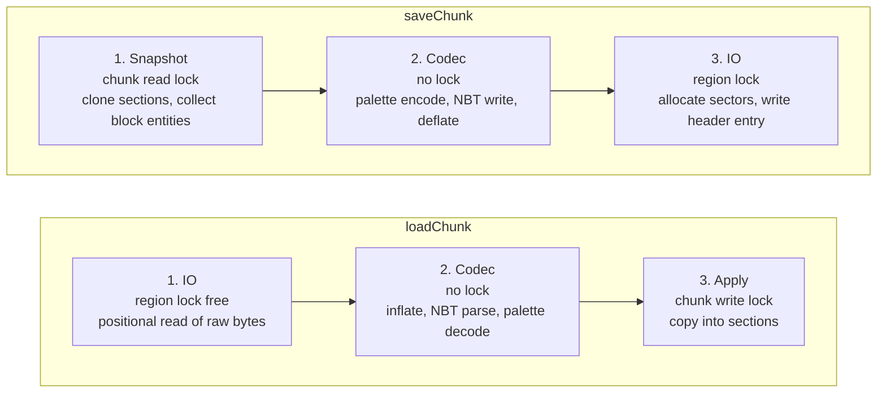
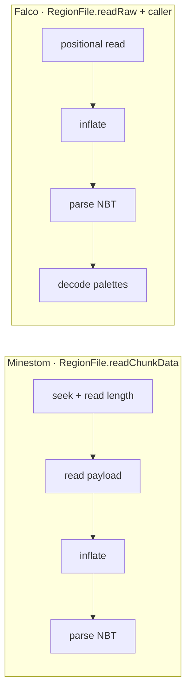
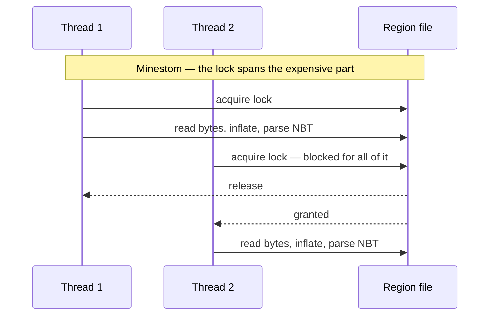
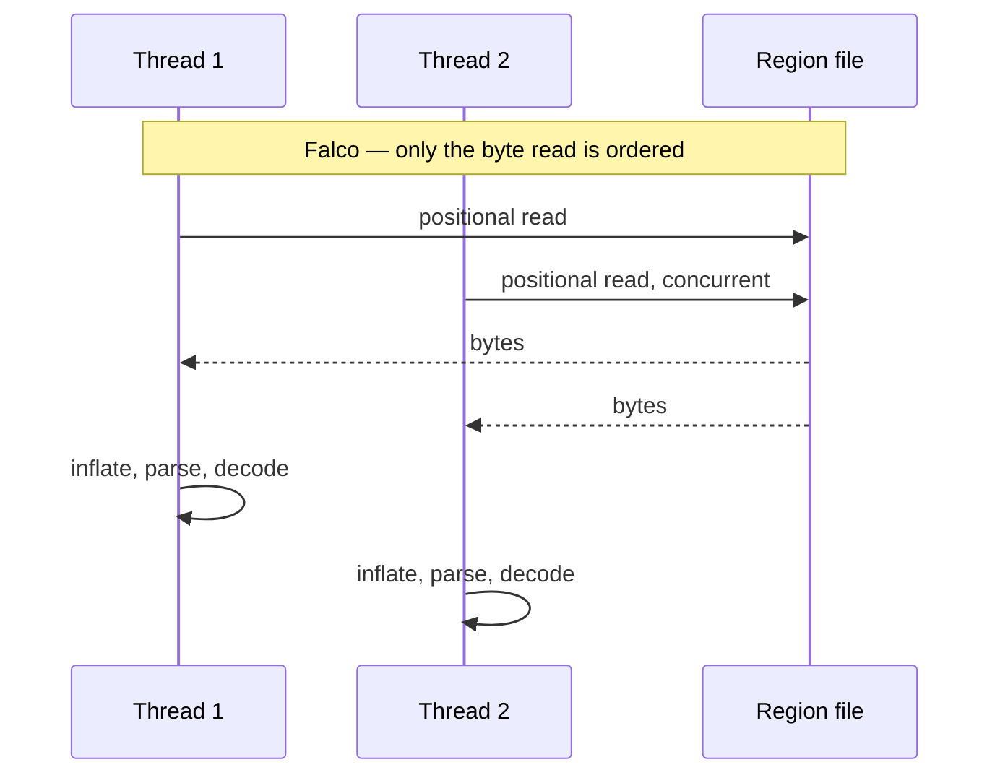
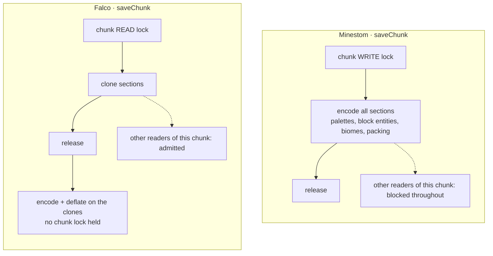
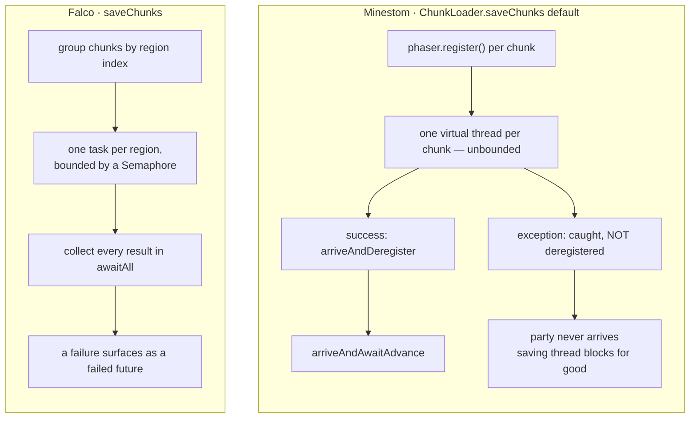
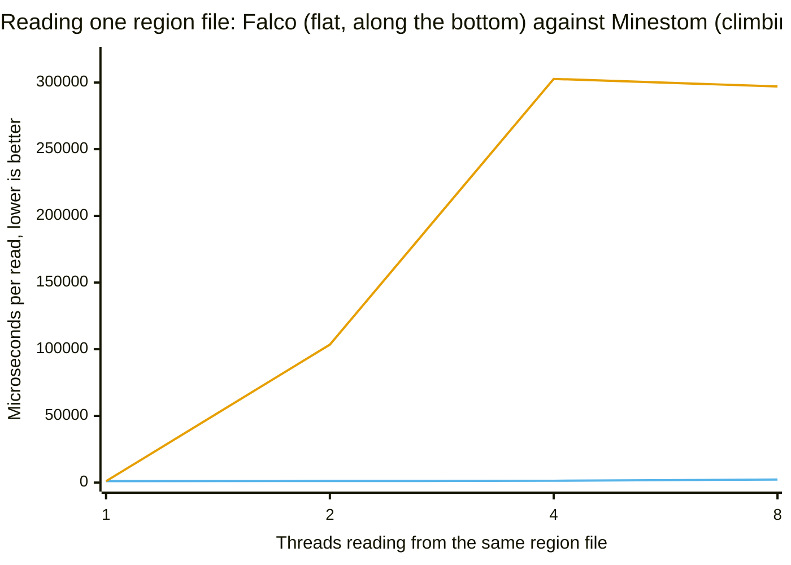
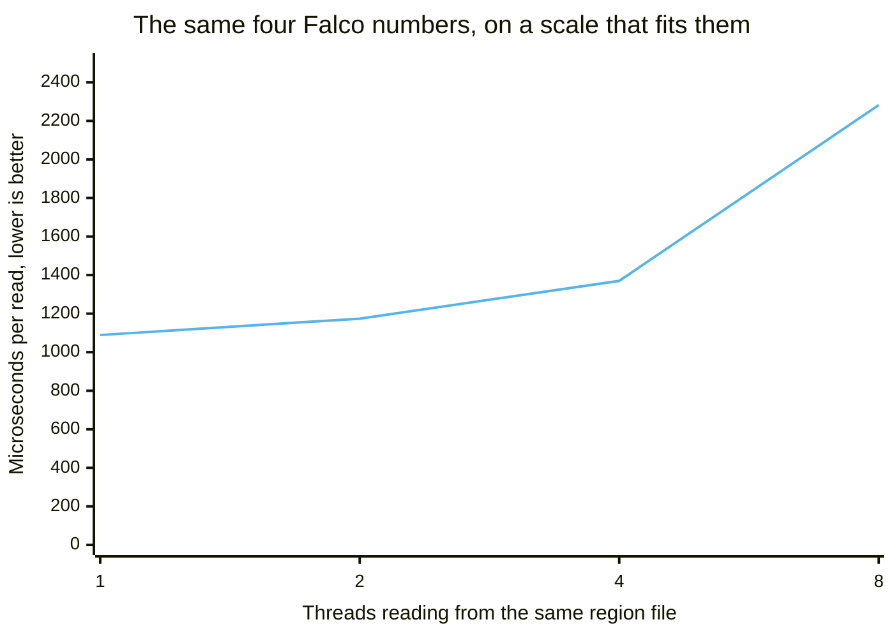
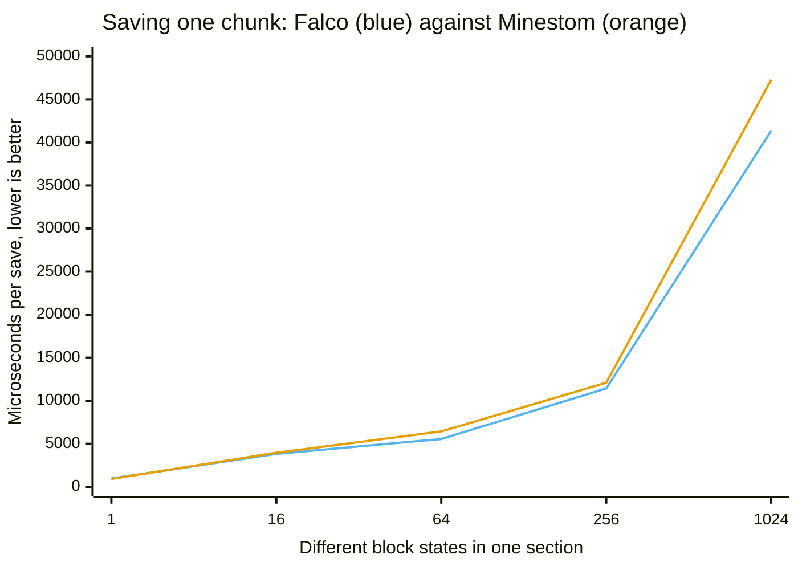

# Anvil chunk loader

`FalcoAnvilLoader` is a `net.minestom.server.instance.ChunkLoader` implementation that reads and
writes chunks in the Anvil region file format (`r.<x>.<z>.mca`). It is a drop-in replacement for
`net.minestom.server.instance.anvil.AnvilLoader` and targets servers that load or save many chunks
concurrently, that need a read failure to stay visible instead of being silently replaced by a
freshly generated chunk, and that need to keep serving worlds containing blocks or biomes the
server does not know. It is not a general world-management layer: it handles the `region/`
directory of a single dimension and nothing else (see
[What this loader does NOT do](#what-this-loader-does-not-do)). All references in this document
point at the sources of this repository and at Minestom `2026.06.20-26.1.2`.

## Status

> **Experimental.** Every public type of `net.onelitefeather.falco.anvil` is annotated
> `@ApiStatus.Experimental`. Signatures, class layout and behaviour may still change in a minor
> release. Do not rely on it in code you cannot adapt.

The annotation is present on all thirteen public types of the package —
[`FalcoAnvilLoader`](../falco-anvil/src/main/java/net/onelitefeather/falco/anvil/FalcoAnvilLoader.java),
[`RegionFile`](../falco-anvil/src/main/java/net/onelitefeather/falco/anvil/RegionFile.java),
[`RegionConstants`](../falco-anvil/src/main/java/net/onelitefeather/falco/anvil/RegionConstants.java),
[`ChunkCompression`](../falco-anvil/src/main/java/net/onelitefeather/falco/anvil/ChunkCompression.java),
[`BitPacker`](../falco-anvil/src/main/java/net/onelitefeather/falco/anvil/BitPacker.java),
[`PaletteData`](../falco-anvil/src/main/java/net/onelitefeather/falco/anvil/PaletteData.java),
[`PaletteEntryResolver`](../falco-anvil/src/main/java/net/onelitefeather/falco/anvil/PaletteEntryResolver.java),
[`BlockPaletteResolver`](../falco-anvil/src/main/java/net/onelitefeather/falco/anvil/BlockPaletteResolver.java),
[`BiomePaletteResolver`](../falco-anvil/src/main/java/net/onelitefeather/falco/anvil/BiomePaletteResolver.java),
[`NbtReads`](../falco-anvil/src/main/java/net/onelitefeather/falco/anvil/NbtReads.java),
[`SectionCodec`](../falco-anvil/src/main/java/net/onelitefeather/falco/anvil/SectionCodec.java),
[`AnvilDiagnostics`](../falco-anvil/src/main/java/net/onelitefeather/falco/anvil/AnvilDiagnostics.java),
[`AnvilChunkException`](../falco-anvil/src/main/java/net/onelitefeather/falco/anvil/AnvilChunkException.java).
(`SectorAllocator` is package-private and carries no annotation.)

**Opt-in only.** Nothing switches to this loader by itself. A server keeps using whatever loader it
uses today until it constructs a `FalcoAnvilLoader` explicitly.

## Usage

### Directly on an instance

```java
import net.kyori.adventure.key.Key;
import net.minestom.server.MinecraftServer;
import net.minestom.server.instance.InstanceContainer;
import net.minestom.server.world.DimensionType;
import net.onelitefeather.falco.anvil.FalcoAnvilLoader;

import java.nio.file.Path;

public final class Bootstrap {

    public static InstanceContainer createLobby() {
        InstanceContainer instance = MinecraftServer.getInstanceManager()
                .createInstanceContainer(DimensionType.OVERWORLD);

        Key dimension = DimensionType.OVERWORLD.key();
        FalcoAnvilLoader loader = new FalcoAnvilLoader(Path.of("worlds", "lobby"), dimension);

        instance.setChunkLoader(loader);
        instance.enableAutoChunkLoad(true);
        return instance;
    }
}
```

`FalcoAnvilLoader(Path worldRoot, Key dimension)` takes the **world root**, not the region
directory. It resolves `worldRoot/dimensions/<namespace>/<value>/region` and falls back to
`worldRoot/region` when only the pre-26.1 layout exists
([`FalcoAnvilLoader#resolveRegionDirectory`](../falco-anvil/src/main/java/net/onelitefeather/falco/anvil/FalcoAnvilLoader.java)).

The loader implements `AutoCloseable`. `close()` flushes and closes every open region file and
writes the summary line
([`FalcoAnvilLoader#close`](../falco-anvil/src/main/java/net/onelitefeather/falco/anvil/FalcoAnvilLoader.java),
[`FalcoAnvilLoader#logSummary`](../falco-anvil/src/main/java/net/onelitefeather/falco/anvil/FalcoAnvilLoader.java)).
Call it on server shutdown. During operation a region file is closed on its own once the last chunk
this loader read from it has been unloaded, and the number of simultaneously open files is capped by
`DEFAULT_OPEN_REGION_LIMIT` (64, configurable through the three-argument constructor).

A region file is never closed while a thread is reading from or writing to it. Every access
registers itself on the cached handle first; an unload, an eviction or `close()` only drops the
handle from the cache, and the thread that leaves it last performs the actual close. That is why a
chunk load cannot fail because another thread unloaded a chunk of the same region, and why a save
needs no retry when the open-file limit evicts its file mid-write. The cap therefore bounds the
number of *cached* files exactly; the number of open descriptors can exceed it for the duration of
a single access.

After `close()` the loader refuses further work with an `IllegalStateException` instead of ignoring
it: `loadChunk`, `saveChunk` and `saveChunks` all throw. Returning `null` from a closed loader would
report the chunk as absent and make the server generate a replacement over the stored data, and
ignoring a save would drop chunk data during the very shutdown it belongs to. A task that is already
past that check and reaches the region cache during the close either finds its handle still valid
and finishes normally, or is refused the same way — it can never publish a handle that nothing
closes again.

### Through the map provider of Aves

[Aves](https://github.com/OneLiteFeatherNET/Aves) knows nothing about this library, and this library
knows nothing about Falco. The two meet at `ChunkLoaderFactory`, which Falco declares as a functional
interface — the provider asks for a `ChunkLoader` and does not care where it comes from.
`AbstractMapProvider` keeps the Minestom loader as its default, so an existing provider is
unaffected until it passes a factory to the four-argument `registerInstance` overload:

```java
import net.minestom.server.instance.InstanceContainer;
import net.minestom.server.world.DimensionType;
import net.onelitefeather.falco.anvil.FalcoAnvilLoader;
import net.theevilreaper.aves.file.FileHandler;
import net.theevilreaper.aves.map.BaseMap;
import net.theevilreaper.aves.map.MapEntry;
import net.theevilreaper.aves.map.provider.AbstractMapProvider;
import net.theevilreaper.aves.util.functional.PathFilter;

import java.nio.file.Path;

public final class LobbyMapProvider extends AbstractMapProvider {

    public LobbyMapProvider(FileHandler fileHandler, PathFilter<MapEntry> mapFilter) {
        super(fileHandler, mapFilter);
    }

    public void register(InstanceContainer instance, MapEntry mapEntry) {
        // Uses FalcoAnvilLoader instead of the Minestom AnvilLoader.
        registerInstance(instance, mapEntry, DimensionType.OVERWORLD,
                (entry, dimension) -> new FalcoAnvilLoader(entry.getDirectoryRoot(), dimension));
    }

    @Override
    public void saveMap(Path path, BaseMap baseMap) {
        // provider specific
    }
}
```

The relevant signatures are:

| Member | Declaration |
| --- | --- |
| `ChunkLoaderFactory#create` (Falco) | `ChunkLoader create(MapEntry mapEntry, Key dimension)` |
| `AbstractMapProvider#registerInstance` (Falco) | `protected void registerInstance(InstanceContainer instance, MapEntry mapEntry, RegistryKey<DimensionType> dimensionKey, ChunkLoaderFactory loaderFactory)` |
| [`FalcoAnvilLoader(Path, Key)`](../falco-anvil/src/main/java/net/onelitefeather/falco/anvil/FalcoAnvilLoader.java) | `public FalcoAnvilLoader(Path worldRoot, Key dimension)` |

The lambda receives `MapEntry.getDirectoryRoot()` as the world root and the dimension key of the
instance. Any other `ChunkLoader` can be supplied the same way.

## Architecture

### The three-stage pipeline

Both loading and saving are split into three stages. The point of the split is that no CPU-bound
work happens while a lock is held. Decompression, NBT parsing, palette conversion and compression
are the expensive parts of chunk IO; if they run inside a per-region lock, adding threads adds
contention and nothing else, because every thread touching the same region file has to wait for
them.



Plain text form:

```
loadChunk:  read raw bytes  ->  inflate + parse + decode  ->  apply to chunk
            (no region lock)      (no lock at all)             (chunk write lock)

saveChunk:  clone sections  ->  encode + write NBT + deflate  ->  write sectors
            (chunk read lock)     (no lock at all)                 (region lock)
```

Concretely:

* **Load stage 1** — `RegionFile.readRaw` returns the still-compressed payload and takes no lock;
  it uses `FileChannel.read(ByteBuffer, long)`, which does not mutate the channel position and is
  therefore safe from several threads
  ([`RegionFile#readRaw`](../falco-anvil/src/main/java/net/onelitefeather/falco/anvil/RegionFile.java),
  [`RegionFile#readEntry`](../falco-anvil/src/main/java/net/onelitefeather/falco/anvil/RegionFile.java),
  [`RegionFile#readFully`](../falco-anvil/src/main/java/net/onelitefeather/falco/anvil/RegionFile.java)).
  Taking no lock does not mean reading whatever is on disk: a chunk which is rewritten releases its
  sector range, and the allocator may hand that range to the next write of any chunk while the reader
  is still inside it. Each of the 1024 entries therefore carries a version counter which a writer
  raises on entry to and on exit from its critical section. The reader takes the counter, rejects an
  odd one, reads the bytes and takes the counter again; anything but an unchanged even counter makes
  it start over, and after four attempts it falls back to the writer lock so a chunk which is
  rewritten in a loop cannot starve it
  ([`RegionFile#readRaw`](../falco-anvil/src/main/java/net/onelitefeather/falco/anvil/RegionFile.java),
  the counters in [`RegionFile.versions`](../falco-anvil/src/main/java/net/onelitefeather/falco/anvil/RegionFile.java),
  the four in [`RegionFile.OPTIMISTIC_ATTEMPTS`](../falco-anvil/src/main/java/net/onelitefeather/falco/anvil/RegionFile.java)).
  Readers are never serialised against each other and never delay a writer.
* **Load stage 2** — decompression and NBT parsing happen in the caller
  ([`FalcoAnvilLoader#loadChunk`](../falco-anvil/src/main/java/net/onelitefeather/falco/anvil/FalcoAnvilLoader.java)).
  `decodeSections` then returns a `List<DecodedSection>`
  ([`FalcoAnvilLoader#decodeSections`](../falco-anvil/src/main/java/net/onelitefeather/falco/anvil/FalcoAnvilLoader.java)),
  and `loadChunk` calls it **before** it takes the chunk lock.
  Everything costly happens here: resolving every palette entry through the resolvers, deriving the
  bits per entry, validating the packed arrays and reading the light arrays. The result is a list of
  immutable records carrying the section index, the decoded block and biome `PaletteData` and the
  two light arrays
  ([`FalcoAnvilLoader.DecodedSection`](../falco-anvil/src/main/java/net/onelitefeather/falco/anvil/FalcoAnvilLoader.java)).
* **Load stage 3** — the chunk write lock is taken, each record is transferred via
  `DecodedSection.applyTo(chunk)`, the block entities are placed, and the lock is released
  ([`FalcoAnvilLoader#loadChunk`](../falco-anvil/src/main/java/net/onelitefeather/falco/anvil/FalcoAnvilLoader.java),
  [`FalcoAnvilLoader#applyBlockEntities`](../falco-anvil/src/main/java/net/onelitefeather/falco/anvil/FalcoAnvilLoader.java)).
  The guarded region performs no parsing and no palette resolution at all — only writes into
  `Section.skyLight()`, `Section.blockLight()`, `Section.blockPalette()` and `Section.biomePalette()`
  ([`FalcoAnvilLoader.DecodedSection#applyTo`](../falco-anvil/src/main/java/net/onelitefeather/falco/anvil/FalcoAnvilLoader.java)).
  This split is the concrete implementation of the pipeline: the record type exists purely to carry
  decoded state across the lock boundary.
* **Save stage 1** — the chunk **read** lock is held only long enough to clone every `Section` and
  collect the block entities
  ([`FalcoAnvilLoader#snapshot`](../falco-anvil/src/main/java/net/onelitefeather/falco/anvil/FalcoAnvilLoader.java)).
* **Save stage 2** — encoding, NBT serialisation and deflate run on the clones, outside every lock
  ([`FalcoAnvilLoader#snapshot`](../falco-anvil/src/main/java/net/onelitefeather/falco/anvil/FalcoAnvilLoader.java),
  [`FalcoAnvilLoader#encodeSection`](../falco-anvil/src/main/java/net/onelitefeather/falco/anvil/FalcoAnvilLoader.java),
  [`FalcoAnvilLoader#saveChunk`](../falco-anvil/src/main/java/net/onelitefeather/falco/anvil/FalcoAnvilLoader.java)).
* **Save stage 3** — the region lock covers sector allocation, the payload write, the 8-byte header
  entry update and, for an oversized chunk, the rename which puts its external file in place. The
  header entry decides which of the two storage locations a reader has to follow, so the entry and
  the file have to change together; only the bytes of the external file are written before the lock
  is taken, into a staging file next to the region file
  ([`RegionFile#writeRaw`](../falco-anvil/src/main/java/net/onelitefeather/falco/anvil/RegionFile.java),
  [`RegionFile#placeExternal`](../falco-anvil/src/main/java/net/onelitefeather/falco/anvil/RegionFile.java),
  [`RegionFile.STAGING_SUFFIX`](../falco-anvil/src/main/java/net/onelitefeather/falco/anvil/RegionFile.java)).

`supportsParallelLoading()` and `supportsParallelSaving()` both return `true`
([`FalcoAnvilLoader#supportsParallelLoading`](../falco-anvil/src/main/java/net/onelitefeather/falco/anvil/FalcoAnvilLoader.java),
[`FalcoAnvilLoader#supportsParallelSaving`](../falco-anvil/src/main/java/net/onelitefeather/falco/anvil/FalcoAnvilLoader.java)),
so `InstanceContainer` dispatches loads onto virtual threads
([Minestom `InstanceContainer.java:362-372`](#references)).

### Classes and their responsibility

Every class in `net.onelitefeather.falco.anvil` has exactly one job, which is what makes
most of the package testable without a running server.

| Class | Single responsibility |
| --- | --- |
| `RegionConstants` | Layout constants of the region format and pure offset/index arithmetic. No state. |
| `SectorAllocator` | Tracks used sectors in a `BitSet`, first-fit allocation, reuse of freed ranges, overlap detection. No file access. |
| `RegionFile` | Byte container for one `.mca` file: header tables, sector placement, raw read/write, `.mcc` overflow. Knows nothing about NBT or Minestom. |
| `ChunkCompression` | The compression scheme byte: id mapping, external flag, compress/decompress. |
| `BitPacker` | Packing and unpacking of palette indices into `long[]`, and derivation of bits-per-entry. Pure functions. |
| `PaletteData` | Immutable palette + packed indices pair; construction from disk, construction from raw values, unpacking. |
| `PaletteEntryResolver` | Interface between named format entries and numeric server ids. |
| `BlockPaletteResolver` | Block name/properties ↔ Minestom block state id, with air fallback. |
| `BiomePaletteResolver` | Biome name ↔ registry id, with plains fallback and lazily resolved registry. |
| `NbtReads` | Strict accessors for Adventure NBT: a missing or mistyped key is an error, not a default. |
| `SectionCodec` | Palette container (`palette` + `data`) ↔ `PaletteData`, for blocks and biomes. |
| `AnvilDiagnostics` | Throttling of repeated warnings and the counters reported on close. Thread safe. |
| `AnvilChunkException` | The unchecked failure signalling that an existing chunk could not be read. |
| `FalcoAnvilLoader` | Orchestration: region file cache, the three stages, block entities, logging, `saveChunks` scheduling. |

`NbtReads` exists because `CompoundBinaryTag` getters return defaults for missing or mistyped keys.
For chunk data that default is dangerous: a malformed region file would decode into an empty chunk
which then overwrites the real data on the next save
([`NbtReads`](../falco-anvil/src/main/java/net/onelitefeather/falco/anvil/NbtReads.java)).
It also avoids the array-tag iterators of Adventure 5.1.1, which stop one entry early
([`NbtReads#longArray`](../falco-anvil/src/main/java/net/onelitefeather/falco/anvil/NbtReads.java),
[`NbtReads#intArray`](../falco-anvil/src/main/java/net/onelitefeather/falco/anvil/NbtReads.java)).

### Lazy registry resolution

`BiomePaletteResolver` does **not** read the biome registry in its constructor. It stores a
`Supplier<DynamicRegistry<Biome>>` and resolves it on first use, behind double-checked locking on a
`volatile` field holding a private `Registries` record
([`BiomePaletteResolver.registrySupplier`](../falco-anvil/src/main/java/net/onelitefeather/falco/anvil/BiomePaletteResolver.java),
[`BiomePaletteResolver.resolved`](../falco-anvil/src/main/java/net/onelitefeather/falco/anvil/BiomePaletteResolver.java),
[`BiomePaletteResolver#registries`](../falco-anvil/src/main/java/net/onelitefeather/falco/anvil/BiomePaletteResolver.java)).
The record pairs the registry with the id of the fallback biome, so both are published together by
a single volatile write
([`BiomePaletteResolver.Registries`](../falco-anvil/src/main/java/net/onelitefeather/falco/anvil/BiomePaletteResolver.java)).

The reason is a hard ordering constraint. `MinecraftServer.getBiomeRegistry()` dereferences the
static `serverProcess` field (Minestom `MinecraftServer.java:280`), which stays `null` until
`MinecraftServer.init(..)` assigns it through `updateProcess` (`MinecraftServer.java:85-88`,
`:95-99`). Calling it earlier throws. Resolving the registry in the constructor would therefore make
a loader impossible to construct before `MinecraftServer.init(..)` has run — which is exactly when
worlds and map providers are normally set up. Deferring the lookup to the first decoded biome
palette means the loader can be constructed at any point during startup, and the registry is read
only once a chunk is actually being loaded.

The same constraint is what makes the Minestom `AnvilLoader` hard to use early and hard to unit
test: it reads the registry in a static initialiser (`instance/anvil/AnvilLoader.java:46-48`), so
merely referencing the class before `init` fails. The two-argument constructor of
`BiomePaletteResolver` exists so a test can inject a registry without a server
([`BiomePaletteResolver(AnvilDiagnostics, Supplier)`](../falco-anvil/src/main/java/net/onelitefeather/falco/anvil/BiomePaletteResolver.java)).

`BlockPaletteResolver` needs no such treatment: `Block.fromKey` and `Block.fromStateId` are static
registry lookups performed per palette entry, not cached at class initialisation
([`BlockPaletteResolver#toId`](../falco-anvil/src/main/java/net/onelitefeather/falco/anvil/BlockPaletteResolver.java),
[`BlockPaletteResolver#toEntry`](../falco-anvil/src/main/java/net/onelitefeather/falco/anvil/BlockPaletteResolver.java)).

## Comparison with the built-in AnvilLoader

**How the two sides are referenced.** Minestom references are a path relative to
`net/minestom/server/` plus a line number, at version `2026.06.20-26.1.2`. Falco references name the
member instead — `RegionFile#writeRaw` for a method, `RegionFile.OPTIMISTIC_ATTEMPTS` for a field or
constant, a bare type name for the type itself — and every Falco type lives under
`falco-anvil/src/main/java/net/onelitefeather/falco/anvil/` unless the reference says otherwise.

The asymmetry is deliberate, not an oversight. The Minestom version is pinned, so those files will
never move again and the line number is the most precise pointer available. The Falco sources are the
sources of this branch and change under active work: the concurrency fixes that introduced the
per-entry seqlock and the region handle use count grew `FalcoAnvilLoader` by roughly four hundred
lines in a single week, which silently pointed every line number in this document at a blank line or
a stray `*/`. A member name survives everything short of a rename, and a rename at least breaks
loudly.

| Aspect | Minestom `AnvilLoader` | Falco `FalcoAnvilLoader` | Impact |
| --- | --- | --- | --- |
| **Chunk length field** | Writes `4 + 1 + N`: `CHUNK_HEADER_LENGTH = 4 + 1` (`instance/anvil/RegionFile.java:31`), `chunkLength = CHUNK_HEADER_LENGTH + dataBytes.length` (`:99`), `file.writeInt(chunkLength)` (`:123`). | Writes `1 + N`: `int length = COMPRESSION_FIELD_SIZE + stored.length`, then `buffer.putInt(length)` (`RegionFile#writeRaw`, `RegionConstants.COMPRESSION_FIELD_SIZE`). | The format defines the field as compression byte + payload. Minestom's own reader compensates by reading `length - 1` bytes (`RegionFile.java:84`), so its files are self-consistent, but every chunk it writes declares four bytes more than it holds. A spec-conforming reader over-reads up to four bytes of sector padding, and when the payload ends within four bytes of a sector boundary it reads past the allocation. Falco writes the value the format specifies. |
| **Short reads** | `file.read(data)` — the return value is discarded (`instance/anvil/RegionFile.java:85`). `RandomAccessFile.read` may return fewer bytes than requested. | `readFully` loops until the buffer is full and reports EOF as an `IOException` (`RegionFile#readFully`), used for both the header (`RegionFile#readHeader`) and the payload (`RegionFile#readEntry`). | A short read in Minestom leaves the tail of `data` zero-filled and is then handed to the NBT parser, producing a parse error or a truncated chunk with no indication of the cause. Falco either has the full payload or fails with the byte counts in the message. |
| **Status key casing** | Reads `"status"` (`instance/anvil/AnvilLoader.java:133`) and writes `"status"` (`:396`). The vanilla key is `Status`. | Reads `Status` first and falls back to `status` (`FalcoAnvilLoader.STATUS_KEY`, `FalcoAnvilLoader.LEGACY_STATUS_KEY`, `FalcoAnvilLoader#isFullyGenerated`); writes `Status` (`FalcoAnvilLoader#snapshot`). | For a vanilla world Minestom's `getString("status")` returns the empty default, which the `status.isEmpty()` branch (`AnvilLoader.java:135`) treats as fully generated — so partially generated vanilla chunks are loaded as if complete, and the warning at `:142` never fires for them. Its own output carries a key vanilla ignores. Falco reads both spellings and writes the vanilla one. |
| **Read failure handling** | `catch (Exception e) { handleException(e); return null; }` (`instance/anvil/AnvilLoader.java:117-120`). | Logs with context, reports to the exception manager and rethrows as `AnvilChunkException` (`FalcoAnvilLoader#failedLoad`). | `null` means "chunk absent" to `InstanceContainer`, which then generates a replacement (`instance/InstanceContainer.java:336-343`) that overwrites the unreadable-but-intact data on the next save. Throwing makes `InstanceContainer` complete the load future exceptionally instead (`:367-372`), so the stored bytes are left untouched. |
| **Unknown block** | `Objects.requireNonNull(Block.fromKey(blockName), "Unknown block " + blockName)` (`instance/anvil/AnvilLoader.java:263`). | `BlockPaletteResolver.toId` substitutes `Block.AIR.stateId()` and reports the name once (`BlockPaletteResolver#toId`). | In Minestom one modded or newer-version block name throws an NPE out of `loadSections`, which is swallowed at `:117-120`; the whole chunk is then regenerated and lost on the next save. Falco loses one block state and keeps the chunk. |
| **Unknown biome** | Falls back to `PLAINS_ID` with no report at all (`instance/anvil/AnvilLoader.java:294-296`). | Falls back to plains and reports the name once through the diagnostics (`BiomePaletteResolver#toId`). | Same resulting data, but in Minestom a world referencing biomes the registry does not have is rewritten to plains silently. Falco leaves a log entry and a counter. |
| **Lock granularity while loading** | One `ReentrantLock` per region file (`instance/anvil/RegionFile.java:42`); `readChunkData` holds it across `seek`, the length/compression read, the payload read **and** the decompression plus NBT parse (`:67-92`, parse at `:88`). | `readRaw` holds no lock and uses positional channel reads (`RegionFile#readRaw`); inflate and NBT parse run in the caller (`FalcoAnvilLoader#loadChunk`), palette decoding before the chunk lock (`FalcoAnvilLoader#decodeSections`). | Minestom serialises the expensive part of every load of the same region behind one lock, so `supportsParallelLoading() == true` yields little for chunks in one region file. In Falco only the byte read touches the file, and it needs no mutual exclusion. |
| **Lock granularity while saving** | The chunk **write** lock is held across the entire serialisation loop for all sections: palettes, block entities, biome lookups, packing (`instance/anvil/AnvilLoader.java:420-519`). Compression itself is outside the region lock (`instance/anvil/RegionFile.java:96-98` before `:104`). | The chunk **read** lock is held only to clone the sections and collect block entities (`FalcoAnvilLoader#snapshot`); everything after that works on the clones (`FalcoAnvilLoader#encodeSection`, `FalcoAnvilLoader#saveChunk`). | Taking the write lock blocks readers as well as writers, for the full duration of encoding a chunk. A read lock over an array of `Section.clone()` calls keeps the chunk readable while it is being serialised. |
| **`saveChunks` default** | `AnvilLoader` does not override it, so `ChunkLoader.saveChunks` applies: one virtual thread per chunk, coordinated by a `Phaser` (`instance/ChunkLoader.java:62-82`). The `catch` branch (`:71-73`) skips `phaser.arriveAndDeregister()`. | Overridden: chunks are grouped by region index, one task per region, concurrency bounded by a `Semaphore` sized to the CPU count (`FalcoAnvilLoader#saveChunks`, `FalcoAnvilLoader.saveLimit`), results collected in `awaitAll` (`FalcoAnvilLoader#awaitAll`). | With a `Throwable` escaping `saveChunk` the registered party is never deregistered, so `phaser.arriveAndAwaitAdvance()` at `ChunkLoader.java:76` never advances and the saving thread blocks for good. Independently, one thread per chunk means every chunk of a region contends for that region's lock while all snapshots are alive at once. Grouping by region removes the contention and the semaphore bounds peak memory. |
| **Chunks over 255 sectors** | `Check.stateCondition(sectorCount >= SECTOR_1MB, "Chunk data is too large to fit in a region file")` (`instance/anvil/RegionFile.java:102`, `SECTOR_1MB = 256` at `:29`), which throws `IllegalStateException` (`utils/validate/Check.java:58-62`). | Payload is written to `c.<x>.<z>.mcc` next to the region file, the location entry stores an empty payload and the compression byte carries `EXTERNAL_FLAG = 0x80` (`RegionFile#writeRaw`, `RegionFile#externalPath`, `ChunkCompression.EXTERNAL_FLAG`). Reading follows the flag (`RegionFile#readEntry`). | A chunk larger than ~1 MiB compressed cannot be saved at all by Minestom; the exception propagates out of `saveChunk`'s `IOException`-only catch (`AnvilLoader.java:402`). Falco uses the external-file mechanism the format defines and deletes a stale `.mcc` when a chunk shrinks again, inside the same critical section which rewrites the header entry (`RegionFile#writeRaw`, `RegionFile#removeExternal`). |
| **Block entities in single-value sections** | Block entities are collected only inside the `getAll` callback of the non-uniform branch (`instance/anvil/AnvilLoader.java:456-468`); when `section.blockPalette().singleValue() != -1` that branch is skipped entirely (`:436-441`). | `collectBlockEntities` walks every block position of the chunk independently of the palette shape (`FalcoAnvilLoader#collectBlockEntities`). | A section whose blocks all share one state id but where some carry NBT or a handler — for example a section of air with handler-marked positions — loses all of its block entities on save in Minestom. |
| **Palette bits-per-entry on load** | `Palette.load(palette, values)` derives bits-per-entry from `palette.length` alone and ignores `values.length` (`instance/palette/PaletteImpl.java:127-132`), called at `instance/anvil/AnvilLoader.java:234` and `:248`. | Derived from the palette size, then verified against the actual `long[]` length (`PaletteData#read`, `BitPacker#resolveBitsPerEntry`); if the two disagree the data is unpacked with the resolved width and written entry by entry (`FalcoAnvilLoader#apply`). | The format permits a writer to use a wider bits-per-entry than the palette size requires. Minestom decodes such a section with the wrong stride, producing wrong blocks with no error. Falco detects the mismatch from the array length and decodes with the width that actually fits. |
| **Palette deduplication on save** | Linear search per block: `blockPaletteIndices.indexOf(value)` on an `IntArrayList` (`instance/anvil/AnvilLoader.java:447`); same for biomes with `biomePalette.indexOf(biomeName)` on an `ArrayList<BinaryTag>` (`:484`). | `PaletteData.encode` assigns indices via `HashMap.computeIfAbsent` (`PaletteData#encode`). | Minestom's per-section cost is O(n·m) for n = 4096 blocks and m = distinct states in the section (biomes: O(64·m) with a deep `BinaryTag` equality per probe). Falco is O(n) hash lookups. This is a structural difference in the algorithm, not a measured figure. |
| **Registry access at class initialisation** | Static fields read the biome registry and the block state count during class init: `BIOME_REGISTRY = MinecraftServer.getBiomeRegistry()`, `PLAINS_ID`, `new CompoundBinaryTag[Block.statesCount()]` (`instance/anvil/AnvilLoader.java:46-48`). | The biome registry is resolved lazily on first use behind a `volatile` field, and the supplier is injectable (`BiomePaletteResolver.resolved`, `BiomePaletteResolver(AnvilDiagnostics, Supplier)`, `BiomePaletteResolver#registries`). Block lookups go through `Block.fromKey` per palette entry (`BlockPaletteResolver#toId`). | Merely referencing `AnvilLoader` before the server registries exist fails in the static initialiser, so the class cannot be constructed during early startup and unit tests must boot a server. In Falco the loader can be constructed before the registries are populated, and the resolver can be tested with a supplied registry. |
| **Logging and diagnostics** | Unthrottled per-chunk `WARN` for partially generated chunks (`instance/anvil/AnvilLoader.java:142`), per-tag `WARN` for invalid sections (`:203`), block entity tags (`:304`) and non-string block properties (`:273-276`). No counters, no summary. | `AnvilDiagnostics` admits only the first occurrence of a distinct name and caps the tracking sets at `MAX_TRACKED_NAMES = 64` (`AnvilDiagnostics.MAX_TRACKED_NAMES`, `AnvilDiagnostics#track`); a partial chunk reports once per loader lifetime (`AnvilDiagnostics#reportPartialChunk`) and a section outside the world is logged at `TRACE` (`FalcoAnvilLoader#decodeSections`). A summary line is written on close (`FalcoAnvilLoader#logSummary`). | A world with many partial chunks or one unknown modded block produces one log line per chunk in Minestom, which buries everything else. In Falco the same condition produces one line plus a counter, and the cap keeps a corrupt world from growing the tracking sets without bound. |
| **Header write per chunk** | `writeHeader` rewrites the whole 8192-byte header on every dirty save (`instance/anvil/RegionFile.java:182-201`, called at `:131`). | `writeEntry` writes only the 4-byte location and the 4-byte timestamp of the affected index (`RegionFile#writeEntry`). | Minestom rewrites 1024 location and 1024 timestamp entries to change one of each. Beyond the write volume, a crash during that rewrite can damage entries of unrelated chunks; an 8-byte update cannot. |
| **Region header validation** | `readHeader` marks every non-zero location in the bitset, checking only that it stays inside the current sector count (`instance/anvil/RegionFile.java:167-172`, `:234-239`). Overlapping entries are accepted. | Entries pointing into the header or with a zero sector count are dropped (`RegionFile#readHeader`) and `SectorAllocator.reserve` rejects an overlapping range with the conflicting sector in the message (`SectorAllocator#reserve`). | Two location entries claiming the same sectors stay undetected in Minestom until one chunk overwrites the other. Falco fails to open such a file with a message naming the sector. |
| **NBT strictness** | Uses the defaulting getters throughout: `sectionData.getCompound("block_states")` returns an empty compound when absent (`instance/anvil/AnvilLoader.java:239`), and an empty palette list then leaves the section untouched (`:242-249`). | `NbtReads` reports a missing or mistyped key as an `IOException` naming the key, the expected type and the actual type (`NbtReads#longArray`, `NbtReads#missing`); `SectionCodec` rejects empty palettes (`SectionCodec#decode`, `SectionCodec#decodeBiomes`). | In Minestom a truncated or malformed section silently loads as untouched (air) and is written back that way. In Falco the same input fails the load, so the stored bytes survive. |
| **Region file lifecycle** | Opened inside `alreadyLoaded.computeIfAbsent(...)`, i.e. blocking file IO inside a `ConcurrentHashMap` mapping function (`instance/anvil/AnvilLoader.java:179-194`); closed when the last chunk of the region unloads (`:557-584`). | Opened outside the mapping function, published with `putIfAbsent`, and a losing race closes the redundant handle (`FalcoAnvilLoader#acquireRegion`); a file is closed once the last chunk this loader loaded is unloaded, with a hard cap on open files as a backstop (`FalcoAnvilLoader.DEFAULT_OPEN_REGION_LIMIT`); a handle in use is only dropped from the cache and closed by its last user. | `computeIfAbsent` holds the bin lock for the duration of the mapping function; performing file IO there blocks other keys hashing to the same bin. Also, `unloadChunk` is called for chunks the loader never loaded (documented at `instance/ChunkLoader.java:102-108`), which makes a plain reference count unreliable — Falco therefore tracks only the chunks it loaded itself and additionally caps the number of open files. |
| **Instance-level and unknown chunk tags** | `loadInstance`/`saveInstance` read and write `level.dat` (`instance/anvil/AnvilLoader.java:96-107`, `:332-343`). Chunk tags other than `Heightmaps`, `sections` and `block_entities` are kept in the chunk tag handler (`:144-151`) and written back on save (`:390`); heightmaps are restored (`:140`). | Neither method is overridden. `snapshot` builds a fixed set of keys: `DataVersion`, `xPos`, `zPos`, `yPos`, `Status`, `LastUpdate`, `sections`, `block_entities` (`FalcoAnvilLoader#snapshot`). | This one favours Minestom. Saving a vanilla chunk with the Falco loader drops `Heightmaps`, `structures`, `block_ticks`, `fluid_ticks`, `PostProcessing` and any other chunk-level tag, and `level.dat` is not touched at all. See the next section. |

Twenty rows. Every reference above was read in the sources of the stated versions.

## Which of those rows carry the argument

The table is flat by construction — every row gets one line, whether it changes what a server does
or tidies a log message. Sorted by consequence they fall into four groups.

**Silent data loss.** The rows that change what ends up on disk: block entities dropped from uniform
sections, the palette stride derived from the palette length alone, the discarded return value of
`read`, the length field written four bytes too large. None of these announce themselves — the world
loads, the chunk looks fine, and the damage surfaces later or in another tool. These are the reason
the loader exists.

**Failure that destroys the original.** A read error returning `null` means "chunk absent" to
`InstanceContainer`, which generates a replacement and overwrites the intact-but-unreadable bytes on
the next save. This one row turns a recoverable problem into an unrecoverable one.

**Concurrency.** Both loaders report `supportsParallelLoading() == true`. Only one of them means it.
This is the group with the largest measured effect, and the diagrams below are about it.

**Everything else** — logging volume, registry access at class-initialisation time, header write
volume — is real but bounded. A server survives all of it.

### Why parallel loading is nominal in Minestom

Both loaders do the same work per chunk: read bytes, inflate, parse NBT, decode palettes. The
difference is which of those steps happens while the region file's lock is held.



In Minestom all four steps sit inside one `ReentrantLock` held per region file
(`instance/anvil/RegionFile.java:42`, parse at `:88`). In Falco only the first one touches the file,
and it needs no mutual exclusion at all: `FileChannel.read(ByteBuffer, position)` does not move the
channel position, so two readers of different chunks do not interfere. Inflate, parse and palette
decode run in the caller.

The consequence appears as soon as two threads want chunks from the same region — which is exactly
what loading a spawn area does, since a region file holds 32×32 chunks:





Since inflate and NBT parsing dominate the load path, putting them inside the lock means extra
threads mostly queue. That is what "nominal parallelism" means here, and the next section measures it.

### Why the save path blocks readers in Minestom

The same question on the write side, with a different answer. Minestom holds the chunk's **write**
lock across the serialisation of every section — palettes, block entities, biome lookups, packing
(`instance/anvil/AnvilLoader.java:420-519`). A write lock excludes readers as well as writers, so
for the whole duration of encoding, nothing else may look at that chunk.

Falco takes the **read** lock, clones the sections, and releases it. Everything after that works on
copies:



### Why one exception in `saveChunks` hangs the saving thread

`AnvilLoader` does not override `saveChunks`, so the interface default applies: one virtual thread
per chunk, coordinated by a `Phaser` (`instance/ChunkLoader.java:62-82`). Its `catch` branch
(`:71-73`) returns without calling `phaser.arriveAndDeregister()`.



Two independent problems in one row. The `Phaser` branch is a liveness bug: a single `Throwable`
escaping `saveChunk` blocks the saving thread permanently. The unbounded thread-per-chunk is a
memory one: every chunk of a region contends for that region's lock while all snapshots are alive at
once. Grouping by region removes the contention, and the semaphore bounds the peak.

## Performance and memory

Two kinds of statement appear below. The **structural** differences are visible in the source of both
implementations and are marked as such. The **measured** ones come from the JMH benchmarks in
`src/jmh` (see [`benchmarks.md`](benchmarks.md)) and name their setup and their spread. Where a cost
is called dominant without a benchmark name attached, it comes from a one-off micro-measurement taken
while designing the loader — treat those as orders of magnitude.

Two facts shaped every decision below. In the load path, zlib inflate plus NBT parsing dominate —
palette handling is a small fraction of the total. In the save path, deflate dominates everything
else. Optimising the palette would therefore have been pointless; keeping compression and parsing
**out of the locks** is where the time actually is.

### Measured: concurrent readers of one region file

`RegionFileComparisonBenchmark` measures the region file of Falco against the one Minestom ships with,
on the same stored bytes, through the same Adventure writer at the same compression level, from a
stored chunk to a parsed compound. It lives in `net.minestom.server.instance.anvil` because
Minestom's `RegionFile` is package-private — the same reason the light comparison lives in Minestom's
light package. Minestom's `AnvilLoader` itself cannot be reached from a benchmark fork at all: its
static fields read the biome registry and the block state count, so the class initialiser fails
before any measurement starts. The region file reads no registry and is measurable directly.

```
java -jar build/libs/falco-*-jmh.jar "RegionFileComparisonBenchmark.(falco|minestom)Read" \
     -f 1 -wi 3 -i 5 -t <threads> -p distinctStates=200
```

| Threads | Falco | Minestom |
| ---: | ---: | ---: |
| 1 | 1 089 ± 48 µs/op | 1 045 ± 112 µs/op |
| 2 | 1 174 ± 71 µs/op | 103 437 ± 856 306 µs/op |
| 4 | 1 370 ± 200 µs/op | 302 704 ± 674 429 µs/op |
| 8 | 2 282 ± 248 µs/op | 297 075 ± 593 563 µs/op |

Repeated at four threads with two forks and ten iterations, which tightens the spread considerably:
Falco **1 325.6 ± 21.1 µs/op** against Minestom **359 690.8 ± 97 498.3 µs/op**, a factor of **271**.

Three things this measurement says, including the ones that do not flatter Falco:

- **On one thread there is no advantage.** Minestom is marginally ahead, well inside the spread. The
  design pays off under contention and nowhere else.
- **Falco degrades gently.** From one to eight threads its cost grows by a factor of 2.1, which is
  what sharing a disk looks like. Minestom does not degrade, it collapses.
- **The size of the collapse is not fully explained.** Pure serialisation of a 1 045 µs operation
  across four threads predicts roughly 4 200 µs, not 360 000. The measured effect exceeds that by
  almost two orders of magnitude, which points at lock convoying or scheduler interaction rather than
  plain queueing. The direction is reproduced across two independent runs and the magnitude is
  stable; the mechanism behind the magnitude has not been investigated. Do not quote the factor as if
  it were understood.

The same measurement as a picture. On one thread the two loaders sit on top of each other; from two
threads onwards one of them stays roughly where it was and the other leaves the chart.



`xychart-beta` cannot draw a legend, so it has to be said instead: the line running along the bottom
is **Falco** (blue in every chart of this document), the one climbing away from it is **Minestom**
(orange). Falco is not actually flat there. It only looks flat because the scale has to reach 300 000
to fit the other line at all. Its own shape is the next chart, and it is the same four numbers.



**Why the first chart looks like that.** Picture a shop with a single till. Minestom's region file
has one lock per file, and it holds that lock not only while it fetches the bytes from disk, but also
while it unpacks them and reads the structure inside them — and the unpacking and the reading are
nearly all of the work. So one customer occupies the till for the entire purchase, and everybody else
stands in the queue. Adding threads adds people to the queue; it does not add tills. Falco holds the
lock only for fetching the bytes and does the unpacking and reading outside it, so several threads
are served at the same time. That is also why the second chart still rises rather than staying level:
those threads do share one disk, and going from one to eight of them costs a factor of 2.1 — but they
spend that time working, not waiting.

Two things the charts are not allowed to imply. First, a drawn line is a mean without its spread, and
at two threads the Minestom measurement is 103 437 ± 856 306 µs/op — an uncertainty eight times the
value itself. That point says "sometimes catastrophic", not "this is what it costs"; the four-thread
control run with two forks is the trustworthy one. Second, standing in a queue does not explain how
high the line goes, as the third bullet above says.

### Measured: saving a chunk

`ChunkSaveComparisonBenchmark` runs the whole save path of both loaders over the same chunk, varying
how many distinct block states a section holds — the axis on which the palette deduplication differs
(linear scan per block against a hash lookup). Compression is held identical on both sides, so this
measures the loaders and not the zlib level.

```
java -jar build/libs/falco-*-jmh.jar "ChunkSaveComparisonBenchmark.(falco|minestom)Save" -f 1 -wi 3 -i 6
```

| Distinct states | Falco | Minestom |
| ---: | ---: | ---: |
| 1 | 968 ± 52 µs/op | 918 ± 39 µs/op |
| 16 | 3 826 ± 279 µs/op | 3 959 ± 227 µs/op |
| 64 | 5 555 ± 305 µs/op | 6 435 ± 421 µs/op |
| 256 | 11 427 ± 980 µs/op | 12 095 ± 1 326 µs/op |
| 1 024 | 41 361 ± 4 082 µs/op | 47 273 ± 3 964 µs/op |

Here the two lines lie almost on top of each other — and that, rather than a gap, is the finding.



No legend again: at the right-hand end the lower of the two lines is Falco (blue) and the upper one is
Minestom (orange). Towards the left they are hard to tell apart, and at the very first point Minestom
is the lower of the two.

**Why so little happens here.** Saving a chunk is mostly one single job: squeezing the data small
before it is written. Both loaders hand that job to the same library at the same setting, so most of
the time is identical by construction. What differs is how each of them writes down the list of block
types a section contains. Minestom searches the list it has built so far once for every single block;
Falco keeps a lookup table and asks it directly — the difference between paging through a book for a
word and going to its index. That really is cheaper, and the more different block types a section
holds the more often it matters, which is why the two lines part towards the right. But it is a small
part of a large job, and no arrangement of it changes what the squeezing costs.

**What the chart must not be read as saying.** Its lines are means, and every point also carries a
spread that a line chart cannot draw. At most of the points that spread is wider than the gap you can
see, so the chart shows a difference the measurement does not establish. The paragraph below names
the two points that survive it.

This is a far smaller effect than the read path, and it deserves to be read conservatively. At one
distinct state Minestom is ahead. At 64 and 1 024 states Falco is ahead by 1.16× and 1.14×, and those
are the only two rows whose spreads do not overlap. The quadratic-versus-linear difference in the
palette is therefore real but modest at realistic section contents — deflate dominates the save path,
and no palette algorithm changes that.

The compression **level** is a separate matter and is measured separately in the same benchmark
(`compressFalcoLevel` against `compressMinestomLevel`): at 256 distinct states the level-2 default of
this loader compresses roughly 2.4× faster than level 6, and 3.1× faster at 1 024. That is a
configuration choice available to either loader, not a property of this one, and it costs roughly
3 % in stored bytes.

### Time

| Property | Minestom | Falco | Why it matters |
|---|---|---|---|
| Work inside the region lock (read) | `readChunkData` holds one `ReentrantLock` across seek, read, decompression and NBT parsing (`instance/anvil/RegionFile.java:42`, `:57-89`) | The read takes no lock at all; only a read that keeps racing a writer falls back to it. Decompression, NBT parsing and palette conversion run in the caller (`RegionFile#readRaw`, `FalcoAnvilLoader#loadChunk`) | This is the whole reason `supportsParallelLoading()` is worth reporting. With the dominant cost inside the lock, extra threads queue instead of working. |
| Concurrent readers of one region | Serialised by the single lock, plus `RandomAccessFile.seek` makes shared use unsafe | `FileChannel.read(ByteBuffer, position)` does not touch the channel position, so readers of different chunks proceed in parallel (`RegionFile#readFully`) | Loading a spawn area touches many chunks of the same region file at once. |
| Chunk lock held while saving | Write lock over the entire serialisation of all sections (`instance/anvil/AnvilLoader.java:420-519`) | Read lock only while cloning sections into a snapshot; serialisation and compression happen after it is released (`FalcoAnvilLoader#snapshot`) | A write lock blocks readers of that chunk; on `saveChunksToStorage` this stalls the tick thread for the duration of the serialisation. |
| Header write per chunk save | Rewrites the full 8192-byte header whenever it is dirty (`RegionFile.java:182-196`) | Patches the 4-byte location entry and the 4-byte timestamp entry only (`RegionFile#writeEntry`) | 8192 bytes versus 8 bytes per save. It also narrows the window in which a crash can damage unrelated entries. |
| Palette deduplication on save | `IntArrayList.indexOf(value)` per block, i.e. a linear scan for each of the 4096 blocks of a section (`instance/anvil/AnvilLoader.java:447`), and the same for biomes (`:484`) | Hash-based index assignment, one lookup per block (`PaletteData#encode`) | Quadratic versus linear in the palette size. Sections with large palettes are the worst case. |
| Re-packing on load | `Palette#load` derives bits per entry from the palette length alone (`instance/palette/PaletteImpl.java:128-129`) | The stored `long[]` is validated and handed over unchanged when its bit width matches; only a mismatching file is unpacked and re-applied (`FalcoAnvilLoader#apply`) | The common case avoids an unpack/repack round trip entirely. The uncommon case is decoded correctly instead of silently misread. |

### Memory

| Property | Minestom | Falco | Why it matters |
|---|---|---|---|
| Concurrency of `saveChunks` | Interface default starts one virtual thread **per chunk** (`instance/ChunkLoader.java:62-82`) | Chunks are grouped per region, one task per group, bounded by a `Semaphore` sized to the available processors (`FalcoAnvilLoader#saveChunks`, `FalcoAnvilLoader.saveLimit`) | The number of chunk snapshots and compressed byte arrays alive at once is bounded by the permit count instead of by the number of chunks being saved. |
| Uniform sections | Written as a full palette container | Collapsed to a single palette entry with no data array (`PaletteData#single`) | A section of pure air or pure stone stores one entry instead of a 4096-entry index array. |
| Repeated array reads | — | `NbtReads` copies each array tag once and never calls `value()` twice | `value()` on an array tag copies on every call; a 4096-entry `long[]` is 32 KiB per copy. |
| Open file handles | Closed when the last chunk of a region unloads, using a reference count that the interface documents as unreliable (`instance/ChunkLoader.java:102-108`) | Closed when the last chunk **this loader loaded** is unloaded, plus a hard cap on open files as a backstop (`FalcoAnvilLoader.DEFAULT_OPEN_REGION_LIMIT`); never closed under a thread that is still reading or writing, and never opened again after `close()` | Unload calls arrive for foreign chunks, so a count alone either leaks handles or closes files still in use. The cap bounds the worst case regardless. |
| Block state cache | `static CompoundBinaryTag[]` sized by `Block.statesCount()`, populated without synchronisation (`instance/anvil/AnvilLoader.java:48`, `:526-531`) | No global cache; palette entries are built per section (`BlockPaletteResolver#toEntry`) | Trades a small amount of repeated work for no shared mutable state and no class-loading-time allocation proportional to the block registry. |

### What is not faster

Being explicit about this, because the table above is one-sided by construction:

- **On a single thread this loader is not faster at all.** Measured on the region file, Minestom
  comes out marginally ahead — 1 045 ± 112 against 1 089 ± 48 µs/op, which is inside the spread of
  both. Everything the design buys is bought under contention. A single-threaded workload that reads
  one chunk at a time gains nothing here and pays for the version counter, the stricter NBT reads and
  the length validation.
- Falco does **not** parse NBT faster — both use adventure-nbt 5.1.1, and parsing is the largest single
  cost in the load path.
- Falco does **not** compress faster — both use `java.util.zip`, and deflate dominates the save path.
- Falco writes **more** data per chunk in one respect: block entities are collected for uniform
  sections too, which Minestom skips (see the comparison table). That is a correctness fix, not a
  saving.
- The palette representation is a value record, so a section snapshot allocates. Minestom mutates a
  palette in place. Falco trades that allocation for the ability to build sections without holding
  the chunk lock.

## What this loader does NOT do

Stated plainly, because each of these is a reason to keep using another loader or another tool.

* **No `entities/` or `poi/` region handling.** Only the `region/` directory is read and written.
  Entity and point-of-interest region files of a vanilla world are ignored and are neither migrated
  nor kept in sync. The Minestom `AnvilLoader` does not handle them either.
* **No DataFixer and no DataVersion migration.** `MinecraftServer.DATA_VERSION` is written into
  every saved chunk ([`FalcoAnvilLoader.dataVersion`](../falco-anvil/src/main/java/net/onelitefeather/falco/anvil/FalcoAnvilLoader.java),
  written by [`FalcoAnvilLoader#snapshot`](../falco-anvil/src/main/java/net/onelitefeather/falco/anvil/FalcoAnvilLoader.java)),
  but the stored `DataVersion` of a chunk being read is never inspected. Data from an older world
  version is interpreted with the current schema. Convert worlds with the vanilla client or
  another tool first.
* **No LZ4 (compression type 4) and no custom compression (type 127).** `ChunkCompression.fromId`
  accepts gzip (1), zlib (2) and uncompressed (3), with the external bit `0x80` masked off; every
  other id raises `The compression scheme <id> is not supported. Only gzip (1), zlib (2) and none (3)
  can be read` ([`ChunkCompression#fromId`](../falco-anvil/src/main/java/net/onelitefeather/falco/anvil/ChunkCompression.java)).
  Unsupported compression therefore fails with an explicit error instead of being misread as
  another scheme. Saving always uses zlib
  ([`FalcoAnvilLoader#saveChunk`](../falco-anvil/src/main/java/net/onelitefeather/falco/anvil/FalcoAnvilLoader.java)).
* **No corruption recovery and no header rebuilding.** A header shorter than 8192 bytes, or a
  location table with overlapping sector ranges, fails the open
  ([`RegionFile#readHeader`](../falco-anvil/src/main/java/net/onelitefeather/falco/anvil/RegionFile.java),
  [`SectorAllocator#reserve`](../falco-anvil/src/main/java/net/onelitefeather/falco/anvil/SectorAllocator.java)).
  There is no scan-and-repair mode, no orphaned-sector reclamation and no defragmentation; freed
  sectors are reused but the file is never shrunk
  ([`SectorAllocator#free`](../falco-anvil/src/main/java/net/onelitefeather/falco/anvil/SectorAllocator.java)).
* **No `level.dat` handling.** `loadInstance` and `saveInstance` are not overridden, so world
  metadata (seed, spawn, game rules, world age) is neither read nor written. `LastUpdate` is
  written as a constant `0`
  ([`FalcoAnvilLoader#snapshot`](../falco-anvil/src/main/java/net/onelitefeather/falco/anvil/FalcoAnvilLoader.java)).
* **No preservation of unknown chunk-level tags.** `snapshot` writes a fixed key set
  ([`FalcoAnvilLoader#snapshot`](../falco-anvil/src/main/java/net/onelitefeather/falco/anvil/FalcoAnvilLoader.java)),
  so `Heightmaps`, `structures`, `block_ticks`, `fluid_ticks` and everything else present in a
  vanilla chunk are lost when that chunk is saved. Heightmaps are not restored on load either.
  Use this loader for worlds the server owns, not as an editor for vanilla worlds you intend to
  open in the client again.

## Error handling and world consistency

The governing rule: **a chunk that exists on disk but cannot be read must not be reported as
absent.**

`ChunkLoader.loadChunk` uses `null` for "this loader has no data for that chunk". `InstanceContainer`
reacts by generating a replacement chunk, caching it and firing the load event
(`InstanceContainer.java:336-343`). That replacement is a normal, dirty chunk, so the next
`saveChunk` writes it over the bytes that failed to read. A transient IO error, a temporarily
unavailable mount or a parser bug therefore does not merely fail a load in Minestom — it destroys
the data it failed to read, without an error visible to the operator beyond one handled exception.

`FalcoAnvilLoader.loadChunk` returns `null` only for the two genuinely-absent cases: no region file
([`FalcoAnvilLoader#acquireRegion`](../falco-anvil/src/main/java/net/onelitefeather/falco/anvil/FalcoAnvilLoader.java)
returns `null` without `create`) and no location entry for the chunk
([`RegionFile#readEntry`](../falco-anvil/src/main/java/net/onelitefeather/falco/anvil/RegionFile.java)
returns `null`, handled in
[`FalcoAnvilLoader#loadChunk`](../falco-anvil/src/main/java/net/onelitefeather/falco/anvil/FalcoAnvilLoader.java)).
A chunk that is present but not fully generated also returns `null` after a throttled warning
([`FalcoAnvilLoader#isFullyGenerated`](../falco-anvil/src/main/java/net/onelitefeather/falco/anvil/FalcoAnvilLoader.java)),
which matches the intent of the format. Every other failure — malformed header, short read,
unsupported compression, broken NBT, palette index out of range — is logged with context, handed to
the exception manager and rethrown as `AnvilChunkException`
([`FalcoAnvilLoader#failedLoad`](../falco-anvil/src/main/java/net/onelitefeather/falco/anvil/FalcoAnvilLoader.java)).
`InstanceContainer` then completes the load future exceptionally instead of generating
(`InstanceContainer.java:367-372`), the chunk stays unloaded, and nothing overwrites it.

`AnvilChunkException` is an unchecked exception so it can cross the `ChunkLoader` interface, which
declares no checked exceptions
([`AnvilChunkException`](../falco-anvil/src/main/java/net/onelitefeather/falco/anvil/AnvilChunkException.java)).

`saveChunk` deliberately does **not** throw. It logs at error level, increments the error counter
and reports to the exception manager
([`FalcoAnvilLoader#saveChunk`](../falco-anvil/src/main/java/net/onelitefeather/falco/anvil/FalcoAnvilLoader.java)).
A failed save has already lost the in-memory state either way; propagating would additionally abort
the surrounding save of every other chunk. The one exception is a save on a **closed** loader: that
is a lifecycle error of the caller rather than a broken chunk, so it propagates as an
`IllegalStateException` and is not counted as a failed chunk. In `saveChunks` a task that fails is reported per group
in `awaitAll` ([`FalcoAnvilLoader#awaitAll`](../falco-anvil/src/main/java/net/onelitefeather/falco/anvil/FalcoAnvilLoader.java)),
and the error count surfaces again in the summary written by `close()`.

## Logging

Only three classes own a logger:

| Class | Logger | Why |
| --- | --- | --- |
| `FalcoAnvilLoader` | yes ([`FalcoAnvilLoader.LOGGER`](../falco-anvil/src/main/java/net/onelitefeather/falco/anvil/FalcoAnvilLoader.java)) | It is the only layer that knows chunk coordinates, region directory and dimension. |
| `BlockPaletteResolver` | yes ([`BlockPaletteResolver.LOGGER`](../falco-anvil/src/main/java/net/onelitefeather/falco/anvil/BlockPaletteResolver.java)) | Reports a substituted block name once; the loader never sees the substitution. |
| `BiomePaletteResolver` | yes ([`BiomePaletteResolver.LOGGER`](../falco-anvil/src/main/java/net/onelitefeather/falco/anvil/BiomePaletteResolver.java)) | Same, for biomes. |

`RegionFile`, `SectorAllocator`, `BitPacker`, `ChunkCompression`, `NbtReads`, `PaletteData`,
`SectionCodec`, `RegionConstants` and `AnvilDiagnostics` deliberately have none. They are leaf
classes that do not know which chunk, region or dimension they are working on, so any line they
logged would be context-free. Instead they throw with the facts they do have — the offending key
and its actual type ([`NbtReads#missing`](../falco-anvil/src/main/java/net/onelitefeather/falco/anvil/NbtReads.java)),
the declared length against the sector allocation
([`RegionFile#readEntry`](../falco-anvil/src/main/java/net/onelitefeather/falco/anvil/RegionFile.java)),
the long count against the entry count
([`PaletteData#read`](../falco-anvil/src/main/java/net/onelitefeather/falco/anvil/PaletteData.java)),
the conflicting sector ([`SectorAllocator#reserve`](../falco-anvil/src/main/java/net/onelitefeather/falco/anvil/SectorAllocator.java)).
The loader catches these and adds the context.

**Message schema.** Every loader message that concerns a chunk ends with the same trailer, so logs
can be grepped and parsed uniformly:

```
... chunk=[{},{}] region={} dim={}
```

for example
`Failed to load the chunk chunk=[{},{}] region={} dim={}`
([`FalcoAnvilLoader#failedLoad`](../falco-anvil/src/main/java/net/onelitefeather/falco/anvil/FalcoAnvilLoader.java)).
Messages that concern a whole region omit the `chunk=` part and keep `region={} dim={}`
([`FalcoAnvilLoader(Path, Key, int)`](../falco-anvil/src/main/java/net/onelitefeather/falco/anvil/FalcoAnvilLoader.java),
[`FalcoAnvilLoader#closeQuietly`](../falco-anvil/src/main/java/net/onelitefeather/falco/anvil/FalcoAnvilLoader.java),
[`FalcoAnvilLoader#close`](../falco-anvil/src/main/java/net/onelitefeather/falco/anvil/FalcoAnvilLoader.java),
[`FalcoAnvilLoader#acquireRegion`](../falco-anvil/src/main/java/net/onelitefeather/falco/anvil/FalcoAnvilLoader.java),
[`FalcoAnvilLoader#awaitAll`](../falco-anvil/src/main/java/net/onelitefeather/falco/anvil/FalcoAnvilLoader.java)).

**Throttling.** `AnvilDiagnostics` decides whether a report is emitted. `reportUnknownBlock` and
`reportUnknownBiome` return `true` only for the first occurrence of a distinct name, and only while
fewer than `MAX_TRACKED_NAMES = 64` names are tracked in that category
([`AnvilDiagnostics.MAX_TRACKED_NAMES`](../falco-anvil/src/main/java/net/onelitefeather/falco/anvil/AnvilDiagnostics.java),
[`AnvilDiagnostics#track`](../falco-anvil/src/main/java/net/onelitefeather/falco/anvil/AnvilDiagnostics.java)).
The cap matters because a broken or heavily modded world can contain an unbounded number of distinct
unknown names, which would otherwise grow the tracking sets indefinitely. `reportPartialChunk` and
`reportSectionOutOfRange` use an `AtomicBoolean` and fire at most once per loader
([`AnvilDiagnostics#reportPartialChunk`](../falco-anvil/src/main/java/net/onelitefeather/falco/anvil/AnvilDiagnostics.java),
[`AnvilDiagnostics#reportSectionOutOfRange`](../falco-anvil/src/main/java/net/onelitefeather/falco/anvil/AnvilDiagnostics.java)) —
the loader currently calls only the first of the two; a section outside the world is logged at
`TRACE` without going through the diagnostics.
The sets are `ConcurrentHashMap.newKeySet()` and the counters are `LongAdder`, so reporting from
many loader threads is safe
([`AnvilDiagnostics()`](../falco-anvil/src/main/java/net/onelitefeather/falco/anvil/AnvilDiagnostics.java)).

Consequence to be aware of: once 64 distinct unknown block names have been seen, further distinct
names are substituted silently. The counters still rise, and `unknownBlockCount()` saturates at 64.

**Close summary.** `close()` writes one line with loaded chunks, saved chunks, errors, distinct
unknown blocks and distinct unknown biomes, plus the region/dimension trailer. It is logged at
`WARN` when the error count is greater than zero and at `INFO` otherwise, so a shutdown that lost
chunks does not read like a clean one
([`FalcoAnvilLoader#logSummary`](../falco-anvil/src/main/java/net/onelitefeather/falco/anvil/FalcoAnvilLoader.java)).

Levels in use: `INFO` for open and clean close, `WARN` for throttled data problems and a close with
errors, `ERROR` for a failed chunk load/save and a region file that could not be closed, `DEBUG`
when a region file is opened, `TRACE` for chunk unloads and skipped out-of-world sections.

## Testing

The full suite is **575 tests, 0 failures, 0 errors**. Thirteen of those classes cover the anvil
package, contributing **178 executed tests**, plus 3 for the factory.

The two columns differ because `@ParameterizedTest` methods expand into one executed test per
argument set. "Declared" counts annotated methods in the source; "executed" is what JUnit actually
ran, taken from `build/test-results/test/TEST-*.xml`.

| Test class | Declared methods | Executed tests | Needs a Minestom server |
| --- | --- | --- | --- |
| `BitPackerTest` | 12 (8 + 4 parameterized) | 34 | no |
| `PaletteDataTest` | 17 (16 + 1 parameterized) | 22 | no |
| `ChunkCompressionTest` | 14 (11 + 3 parameterized) | 21 | no |
| `FalcoAnvilLoaderIntegrationTest` | 19 | 19 | **yes** |
| `NbtReadsTest` | 15 | 15 | no |
| `RegionFileTest` | 14 | 14 | no |
| `SectionCodecTest` | 13 | 13 | no |
| `AnvilDiagnosticsTest` | 10 | 10 | no |
| `SectorAllocatorTest` | 9 (8 + 1 parameterized) | 10 | no |
| `RegionFileConcurrencyTest` | 6 | 6 | no |
| `AnvilDiagnosticsConcurrencyTest` | 5 | 5 | no |
| `FalcoAnvilLoaderLifecycleTest` | 5 | 5 | **yes** |
| `FalcoAnvilLoaderConcurrencyTest` | 4 | 4 | **yes** |
| **Total (anvil package)** | **143** | **178** | |
| `map/provider/ChunkLoaderFactoryTest` | 3 | 3 | no |

**Layers that need no server.** Ten of the thirteen classes import nothing from `net.minestom`. That
is a direct consequence of the class split: `RegionConstants`, `SectorAllocator`, `RegionFile`,
`ChunkCompression`, `BitPacker`, `PaletteData`, `SectionCodec`, `NbtReads` and `AnvilDiagnostics`
have no dependency on the server or its registries. `SectionCodecTest` exercises the codec through a
stub `PaletteEntryResolver`, so palette encoding and decoding are verified without touching the block
or biome registry. `RegionFileTest` works on real files in a `@TempDir`. `ChunkLoaderFactoryTest`
only checks which loader type a factory produces and which path it receives, so it needs no server
either.

`RegionFileConcurrencyTest` and `AnvilDiagnosticsConcurrencyTest` hammer the same file and the same
diagnostics from several threads and stay server-free for the same reason.

**The layer that does.** Three classes need one: `FalcoAnvilLoaderIntegrationTest`,
`FalcoAnvilLoaderLifecycleTest` and `FalcoAnvilLoaderConcurrencyTest`. The first is annotated
`@ExtendWith(MicrotusExtension.class)` (Cyano) and receives an `Env` parameter, from which it builds
instances with `env.createEmptyInstance(loader)`
([`FalcoAnvilLoaderIntegrationTest`](../falco-anvil/src/test/java/net/onelitefeather/falco/anvil/FalcoAnvilLoaderIntegrationTest.java)).
It needs a real server because the loader touches `Chunk`, `Section`, `Palette`, the block registry
and the biome registry. It covers the chunk round trip through a real region file: absent chunks,
block round trip, region file placement in the dimension directory, NBT on blocks, block properties,
parallel saving and parallel loading. The other two use the same extension: the lifecycle test covers
what a closed loader does with further loads and saves, the concurrency test the loader under several
threads at once, including the open-region limit and the eviction of a region file that is being read.

There is no dedicated unit test for `BlockPaletteResolver` and `BiomePaletteResolver`; both are
covered only indirectly through the integration test. `BiomePaletteResolver` accepts an injectable
`Supplier<DynamicRegistry<Biome>>` for exactly this purpose
([`BiomePaletteResolver(AnvilDiagnostics, Supplier)`](../falco-anvil/src/main/java/net/onelitefeather/falco/anvil/BiomePaletteResolver.java)),
so a server-free test for it is possible and currently missing.

Run everything with:

```bash
./gradlew test
```

## References

Minestom sources cited here, at version `2026.06.20-26.1.2`:

* `net/minestom/server/instance/anvil/AnvilLoader.java`
* `net/minestom/server/instance/anvil/RegionFile.java`
* `net/minestom/server/instance/ChunkLoader.java`
* `net/minestom/server/instance/InstanceContainer.java`
* `net/minestom/server/instance/palette/PaletteImpl.java`
* `net/minestom/server/instance/palette/Palette.java`
* `net/minestom/server/utils/validate/Check.java`
* `net/minestom/server/instance/DynamicChunk.java`

Format reference: [Region file format](https://minecraft.wiki/w/Region_file_format),
[Chunk format](https://minecraft.wiki/w/Chunk_format).
