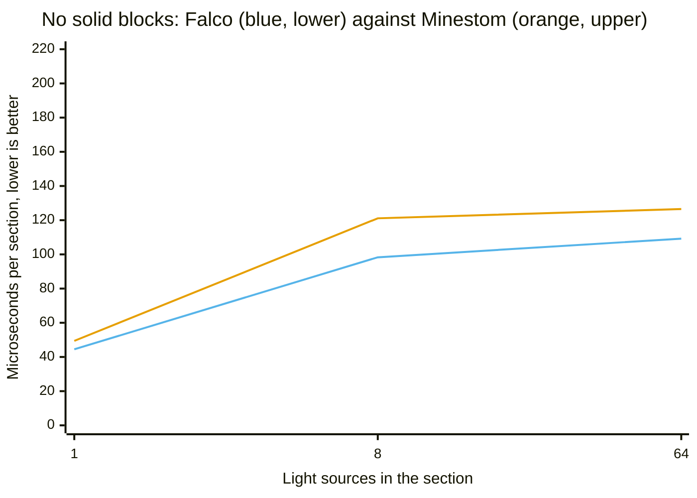
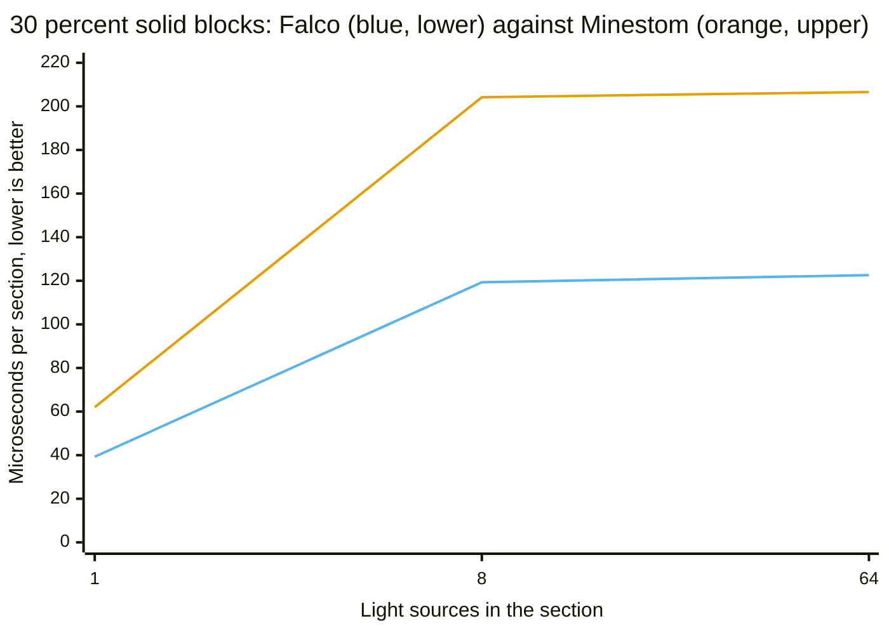
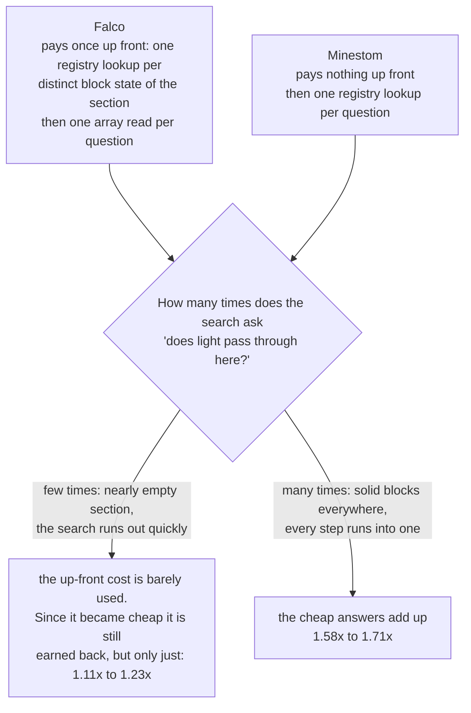
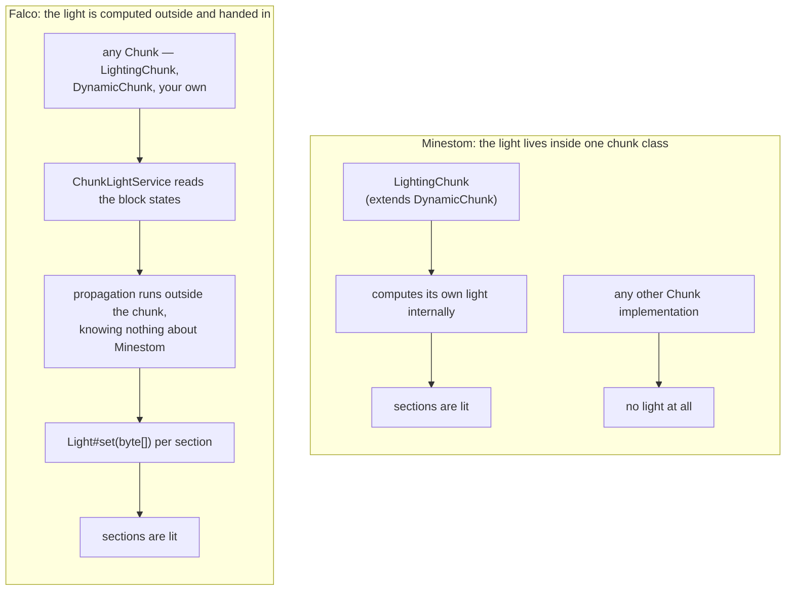
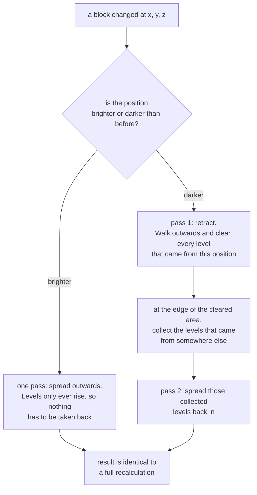

# Light engine

A light propagation for a single section that resolves the properties of a block once instead of on
every visit, and stores a uniform section without an array. The algorithm itself knows nothing about
Minestom, which is what makes it testable without a running server.

> **Experimental.** Every public type of `net.onelitefeather.falco.light` is annotated
> `@ApiStatus.Experimental`. The API may still change.

> **Scope.** Block light and sky light for a chunk, across section borders, across chunk borders,
> and incrementally after a single block changed. Works with any chunk of any loader. Either call it
> yourself, or hand the instance a chunk supplier and let the light
> [keep itself up to date](#letting-the-chunk-keep-its-own-light).
> See [Limits](#limits) for what is still missing.

## When this is worth using

Honest answer first, because it decides whether the package is relevant at all:

| Workload | Does light computation run? |
| --- | --- |
| Loading pre-lit worlds from `.mca` | **No.** The stored light is applied with `Light#set`, which clears `requiresUpdate()`. Nothing is recomputed — unless you call this engine explicitly. |
| Generated worlds without stored light | Yes |
| Runtime block placement | Yes |

For loading pre-built maps from region files — the dominant Falco use case — a light engine
contributes nothing, because that code path never executes. The measured cost of loading such a
chunk is dominated by NBT parsing and zlib inflation instead.

## Design

Eight types compute the light, each with one responsibility. Only the two on the right know Minestom
exists. A further five, listed [further down](#letting-the-chunk-keep-its-own-light), decide *when* it
is computed and never how.

```
                      ┌─ engine, no Minestom ─────────────┐   ┌─ adapter ──────────────┐
                      │                                   │   │                        │
  Chunk ──────────────┼──► int[] stateIds                 │   │  ChunkLightService     │
                      │         │                         │   │        │               │
                      │         ▼                         │   │        │ uses          │
                      │   SectionOpacity ◄── BlockLightSource ◄── MinestomBlockLight-  │
                      │         │            (one lookup   │   │        Source          │
                      │         ▼             per state)   │   │                        │
                      │   ChunkLightPropagator             │   │  writes back through   │
                      │         │  (crosses section        │   │  Light#set(byte[])     │
                      │         ▼   borders)               │   │                        │
                      │   List<LightNibbles> ──────────────┼───┼──►  Chunk sections     │
                      └───────────────────────────────────┘   └────────────────────────┘
```

| Type | Responsibility |
| --- | --- |
| `LightNibbles` | Storage. Two levels per byte, uniform sections without an array. |
| `BlockLightSource` | Abstraction over "how bright is this block and which faces does it block". |
| `SectionOpacity` | Precomputed table of those properties for one section. |
| `LightPropagator` | The breadth-first propagation, with reusable buffers. |
| `ChunkLightPropagator` | The same search across all sections of a chunk, so light crosses their borders. |
| `MinestomBlockLightSource` | Answers `BlockLightSource` from the block registry. |
| `ChunkLightState` | Keeps a calculated result and updates it incrementally, including the retraction pass and the sky heightmap. |
| `ChunkLightService` | Reads a chunk, runs the propagation, settles the borders against the neighbours, writes the result back. |

`BlockLightSource` exists for the same reason `PaletteEntryResolver` does in the Anvil package: it
keeps the registry out of the algorithm, so the propagation is verified with a handful of fake
blocks and no server at all.

## Where the resources are saved

### Time

The dominant cost of a naive propagation is not the search but the block lookups. A breadth-first
search reaches a block from up to six directions, and resolving palette → block → registry →
occlusion shape on each of those visits repeats the same work.

`SectionOpacity` resolves every **distinct state id** of a section exactly once when the table is
built and answers from two flat `byte[]` afterwards — an array index instead of a registry walk.
A section of 4096 stone blocks costs one lookup, which
`SectionOpacityTest#testEveryDistinctStateIsResolvedOnlyOnce` pins down.

Two further short cuts:

- A section without any emitting block returns immediately with a uniform dark result. No buffer is
  touched, no queue is built.
- Because a level drops by exactly one per block and the search is breadth-first, every position is
  reached with its final level on the first visit. No position is ever revisited or re-queued.

### Memory

- **Uniform sections carry no array.** `LightNibbles` keeps a single level and allocates the
  2048-byte array only when a level actually differs. Most sections of a world are either fully dark
  or fully lit, so this is the common case rather than an edge case. `fill` releases the array again.
- **A fully dark section reports an empty array** (`toArray().length == 0`), which is how the file
  format stores "no light" — nothing is written for it.
- **The propagator reuses its buffers.** The level buffer and the queue are allocated once per
  instance and cleared per run, so repeated propagation allocates nothing beyond the result. An
  instance is therefore reusable but thread confined — use one per worker rather than sharing one.
- **The queue is an `int[]`, not a collection.** No boxing, no growth: a section has 4096 positions
  and each is queued at most once, so the array is sized exactly once.
- **Building the table allocates nothing per block.** The lookup is a linear probing table over the
  raw state id, so no key is boxed and no value object is created; a resolved state is packed into a
  short that carries the occluded faces and the emission together. A run of one repeated state is
  answered from the previous block instead of the table, because the blocks of a world come in runs.
  This is what took the build of one section from 74 040 to 8 664 bytes and is the single largest
  reason for the times [further down](#compared-with-the-light-engine-minestom-ships-with).

## Correctness details worth knowing

**Occlusion is per face, not per block.** Roughly one in seven block types of the game occludes some
faces and not others — slabs, stairs, snow, farmland, dirt paths, lecterns, stonecutters. A design
storing one flag per block answers those wrongly. `SectionOpacity` stores a six-bit mask per block;
`MinestomBlockLightSourceTest` pins the behaviour down on real bottom and top slabs.

**Only the entered face is tested.** Light passing from A to B is blocked by the face of **B** it
enters, not by the face of A it leaves. Testing both would leave every emitting block that is opaque
itself dark — and glowstone is exactly that. This is checked end to end against the real registry.

**Unknown block states are transparent, not fatal.** `Block.fromStateId` indexes an array without a
bounds check and throws for an id outside the known range. The adapter turns that into an absent
block, because a propagation must not lose a whole section over one unknown state.

**The face mapping is pinned by a test.** The adapter maps its faces onto the server's by ordinal.
`testTheFaceOrderMatchesTheOneOfTheServer` fails if Minestom ever reorders its enum, which would
otherwise silently shift every occlusion answer to the wrong face.

## Compared with the light engine Minestom ships with

`LightEngineComparisonBenchmark` runs both engines over the same section, from a block palette to a
finished light array of 2048 bytes. It lives in `net.minestom.server.instance.light` because the two
methods that make up the built-in path — `BlockLight.buildInternalQueue` and `LightCompute.compute` —
are package-private, which is the only way to measure the original instead of a copy of it. Neither
side gets to skip its preparation: the built-in path builds its seed queue, and the Falco path builds
its opacity table through the real block registry rather than a stand-in.

**The two engines produce the same light, and that is now checked rather than claimed.**
`LightEngineEquivalenceTest` compares them byte for byte over 54 scenarios — nine source counts
against six shares of solid blocks — and runs with `./gradlew test` like any other test. The
benchmark repeats the same check in its `@Setup` and aborts the trial when the two disagree. Until
recently this document asserted the byte identity while nothing in the build verified it; the
statement happened to be true, but a change that broke it would have passed unnoticed. Nothing in
this section is a statement about correctness — correctness is equal, not better. Everything below is
about time.

The numbers in this section were measured with `-f 1 -wi 5 -i 10` on a quiet machine, one section per
operation, `score ± error`, lower is better. Every source emits level 15; sections whose sources
differ in brightness are measured separately, [further down](#sources-of-mixed-brightness).

```
java -jar build/libs/falco-*-jmh.jar "LightEngineComparisonBenchmark.(falco|minestom)" \
    -p emissionMix=UNIFORM -f 1 -wi 5 -i 10
```

| Light sources | Solid blocks | Falco | Minestom | Falco is |
| ---: | ---: | ---: | ---: | --- |
| 1 | 0 % | 44.5 ± 0.6 µs/op | 49.4 ± 1.3 µs/op | 1.11× faster |
| 8 | 0 % | 98.3 ± 2.4 µs/op | 121.1 ± 5.5 µs/op | 1.23× faster |
| 64 | 0 % | 109.2 ± 1.6 µs/op | 126.5 ± 5.6 µs/op | 1.16× faster |
| 1 | 30 % | 39.3 ± 0.8 µs/op | 62.0 ± 2.0 µs/op | 1.58× faster |
| 8 | 30 % | 119.3 ± 3.5 µs/op | 204.2 ± 3.7 µs/op | 1.71× faster |
| 64 | 30 % | 122.6 ± 1.3 µs/op | 206.6 ± 4.2 µs/op | 1.68× faster |

These numbers replace an earlier set in which Falco lost four of the six scenarios. What changed is
not the algorithm but the table it works from: building `SectionOpacity` allocated a throwaway lambda
per block, which is [broken down below](#where-the-gain-came-from). A shorter run on a loaded machine
reproduces the same ordering and the same rough magnitudes, with the wider spreads a loaded machine
produces.

### A section without solid blocks: the narrow half of the result

This is where the two engines are closest, because it is where Falco has the least to gain: nothing
blocks the light, so the search rarely has to ask whether it may pass.



`xychart-beta` draws no legend, so: the first line, the lower one, is **Falco** (blue); the upper one
is **Minestom** (orange). The scale runs to 220 although nothing here comes close to it, so that this
chart and the next one can be held against each other.

**Why the margin is small here.** Before Falco computes anything, it goes through the section once and
notes down for every block whether light passes through it. That note costs time before a single ray
has moved. In a section with nothing in it, the search hardly ever consults it, so the preparation is
paid for and barely used. This is the shape of the workload on which Falco was behind until the
preparation itself became cheap enough for the remainder to be earned back; 1.11× at one source is
what is left of that, and it is the smallest margin in the table for exactly this reason.

**How firm that is.** The spreads do not overlap at any of the three points — 44.5 ± 0.6 against
49.4 ± 1.3, 98.3 ± 2.4 against 121.1 ± 5.5, 109.2 ± 1.6 against 126.5 ± 5.6. The direction is
established; the size of the gap at one source is small enough that a different machine could move it.

### A section with solid blocks: the wide half

Once 30 % of the blocks are solid, the same mechanism works in the other direction.



Same order and the same colours as before: the first line is **Falco** (blue), the second **Minestom**
(orange). The distance between the lines is several times what the previous chart shows, on the same
scale.

**Why.** Now the note earns its keep. Solid blocks are exactly what a spreading light keeps running
into, and every time it does, the same question comes up again: does light get through here? Falco
reads the answer off the note it wrote at the start — one position in an array. Minestom asks the
registry again each time. The more often the question is asked, the more the one-off cost of writing
the note is worth; and how often it is asked is set by how many light sources are spreading and how
much they run into.

That is the whole shape of the result, and it is what the optimisation moved:



The up-front cost has not disappeared, it has shrunk. The break-even point that used to sit inside
the measured range now sits below its sparsest configuration, which is why the left branch reads as a
small win instead of a loss. A section that is sparser still — no sources at all — is answered
without a search or a table at all, so it never reaches this decision.

**How firm that is.** None of the six spreads overlap. The widest margins, 8 and 64 sources at 30 %
solid, are also the ones with the tightest errors on both sides: 119.3 ± 3.5 against 204.2 ± 3.7 and
122.6 ± 1.3 against 206.6 ± 4.2.

### Where the gain came from

`LightEngineStageBenchmark` splits both engines into their stages, which is what identifies the cost.
For one light source in an open section, in microseconds:

| | readStates | opacity | propagate | collect | full |
| --- | ---: | ---: | ---: | ---: | ---: |
| before | 7.70 | **31.33** | 33.85 | 0.24 | 77.1 |
| after | 7.23 | **8.07** | 31.41 | 0.23 | 46.3 |

Building the opacity table was 41 % of the whole path and is now 17 % of a much shorter one. The
table allocated a throwaway lambda per block; removing that took the allocation of one call from
74 040 bytes to 8 664. The search and the two transfer stages are unchanged, as they should be —
nothing about the algorithm was touched.

**One number in there corrects the story this document used to tell.** The Falco *search* was already
the faster of the two before the change: 33.9 µs against the 53.9 µs the built-in search takes. The
entire deficit came from the preparation, not from the propagation. The earlier text explained the
losses as a property of the algorithm's shape; they were a property of one allocation.

### Sources of mixed brightness

Every scenario above places glowstone, so every source starts at level 15. Real interiors are lit
with torches, lanterns and magma blocks side by side, and `emissionMix=MIXED` builds exactly that:
the same positions, drawn from the same seed, filled with glowstone 15, lantern 15, torch 14,
redstone torch 7 and magma block 3.

```
java -jar build/libs/falco-*-jmh.jar "LightEngineComparisonBenchmark.(falco|minestom)" \
    -p emissionMix=MIXED -p lightSources=8,64 -f 1 -wi 3 -i 5
```

| Light sources | Solid blocks | Falco | Minestom | Falco is |
| ---: | ---: | ---: | ---: | --- |
| 8 | 0 % | 118.97 ± 8.89 µs/op | 126.54 ± 9.55 µs/op | 1.06× faster |
| 8 | 30 % | 116.50 ± 7.63 µs/op | 201.46 ± 16.83 µs/op | 1.73× faster |
| 64 | 0 % | 150.42 ± 32.73 µs/op | 162.20 ± 3.11 µs/op | 1.08× faster |
| 64 | 30 % | 149.42 ± 12.64 µs/op | 252.26 ± 9.28 µs/op | 1.69× faster |

A single source is not measured under `MIXED`: the first block of the set is glowstone, so a lone
source is the identical section `UNIFORM` already covers.

**Mixed levels cost Falco more than they cost Minestom.** Held against the same scenario under
`UNIFORM` in the same run, the Falco time at 64 sources in an open section rises by about a third, and
the margin over Minestom falls from roughly 1.3× to the 1.06× above — the mixture costs Falco more
than it costs the built-in engine. The reason is in the search: it assumes the queued positions are
ordered by level, which is true only while every source starts at the same one. With mixed levels a
position can be reached again later by a brighter wave, and the same positions are touched more than
once. In the 30 % rows the margin is unaffected — 1.73× and 1.69× against the 1.71× and 1.68× of the
uniform table — because there the cheap opacity answers still dominate what the search spends.

Falco is ahead in all four, but the open-section pair is close enough that the two are effectively
level there. If a bucket queue is ever added to the propagator, this is the parameter that will show
whether it was worth it — and the reason it is a parameter rather than a constant.

### Which of the two is the steadier

In the run above, Falco has the smaller absolute spread at every one of the six points: ± 0.6 to
± 3.5 against ± 1.3 to ± 5.6. Measured relative to the score the picture is almost the same, with one
exception — at 8 sources and 30 % solid Minestom is the tighter of the two (1.8 % against 2.9 %).
The earlier version of this document reported the opposite across the board, on an earlier run and a
loaded machine; the drop in allocation is the likeliest reason the Falco spread fell, since it removes
the garbage collector from the measurement.

That comparison holds within one run, on one machine. The confirmation run on a loaded machine has
spreads several times wider on both sides, which is what a loaded machine does and not a property of
either engine.

### On concurrency there is nothing to win here

The Anvil comparison in [`anvil-chunk-loader.md`](anvil-chunk-loader.md) turns on a lock that is held
across expensive work. It would be convenient to claim the same thing on the light side, and it is
not true. Minestom's light path is already built for several threads: `LightCompute` is purely static
and allocates its buffer per call, `BlockLight` keeps its buffers per section, and `LightingChunk`
already uses an `Executors.newWorkStealingPool()`. Nothing in there serialises work that could be
running in parallel, so there is no contention to remove.

### How the light reaches the chunk

This is the one argument for this engine that does not depend on a measurement, and it is the
strongest one. Minestom computes light **only** inside `LightingChunk` (`LightingChunk extends
DynamicChunk`). Use any other chunk implementation and no light is computed at all. Falco computes
outside the chunk and hands the finished array over through `Light#set`, which every chunk accepts.



The same property has a second consequence: because the propagation references no Minestom class at
all, it can be tested against a handful of fake blocks without a running server. Only the adapter
that answers from the real registry needs one.

**Being outside the chunk does not mean giving up the convenience of being inside it.**
`FalcoLightingChunk` offers the same one-line setup as `LightingChunk` while the computation stays in
a service that any chunk type can be handed to — see
[Letting the chunk keep its own light](#letting-the-chunk-keep-its-own-light). The two are not
alternatives: the chunk is a caller of the service like any other.

### When to use Minestom's engine instead

The reason this section used to give — the built-in engine is faster on sparsely occupied sections —
no longer holds, so it needs restating rather than deleting.

If you already use `LightingChunk`, there is still no obligation to change anything. The built-in
engine is wired into the server, costs no extra code and no extra call site, and on an open section
lit by sources of differing brightness the two are within a few percent of each other. Swapping a
working light path for a margin that small is not a good trade on its own.

What does argue for this engine is the case the built-in one does not cover at all: any chunk that is
not a `LightingChunk`, which includes the chunk type an `InstanceContainer` uses unless it is told
otherwise. After that come the workloads where the margin is actually large — sections carrying a
real share of solid blocks, where the measurements above put it between 1.58× and 1.73× — and the
control over *when* light is computed that comes from computing it outside the chunk.

The convenience argument has stopped being one either way. `setChunkSupplier(scheduler.supplier())`
is the same amount of setup as `setChunkSupplier(LightingChunk::new)`, so choosing between the two is
now a question about the engine rather than about how much wiring it takes.

## Usage

```java
import net.onelitefeather.falco.light.LightNibbles;
import net.onelitefeather.falco.light.LightPropagator;
import net.onelitefeather.falco.light.MinestomBlockLightSource;
import net.onelitefeather.falco.light.SectionOpacity;

// One per worker thread; it keeps reusable buffers.
LightPropagator propagator = new LightPropagator();
MinestomBlockLightSource source = new MinestomBlockLightSource();

int[] stateIds = new int[LightNibbles.BLOCK_COUNT];  // block states of one section
// ... fill stateIds from a palette ...

LightNibbles light = propagator.propagate(SectionOpacity.of(stateIds, source));

int level = light.get(8, 8, 8);
byte[] stored = light.toArray();                     // empty when the section is dark
```

`BlockLightSource` can be implemented directly to run the engine without a server:

```java
BlockLightSource fake = new BlockLightSource() {
    @Override public int emission(int stateId) { return stateId == LAMP ? 15 : 0; }
    @Override public boolean blocksFace(int stateId, BlockFace face) { return stateId == STONE; }
};
```

## Using it with a chunk loader or an instance

`ChunkLightService` is the entry point. It reads the block states of a chunk, propagates, and hands
the result to the sections through `Light#set(byte[])`:

```java
import net.onelitefeather.falco.light.ChunkLightService;

// Keeps no state between calls, so a single instance serves as many threads as you like.
ChunkLightService lighting = new ChunkLightService();

Chunk chunk = instance.loadChunk(0, 0).join();
lighting.calculate(chunk);

int level = lighting.blockLightAt(chunk, 8, 40, 8);
```

This works with **any** chunk, regardless of which loader produced it — the Anvil loader of Falco,
the one Minestom ships with, or a generated chunk. A test covers the round trip through
`FalcoAnvilLoader` explicitly.

Two properties make this the stable way in:

- `Light#set(byte[])` is not marked internal, unlike `calculateInternal` / `calculateExternal`. The
  service therefore does not implement the `Light` interface and cannot break when the signatures of
  those internal methods change.
- `set` clears the update flag of the section, so the server does not recompute what was just
  written. A wrong result is therefore never corrected on its own, which is why every write path is
  covered by a test.

**One service is enough for a whole server.** Unlike `LightPropagator` above, `ChunkLightService`
keeps no state between calls — the working buffers live in a propagator built per call — so a single
instance may be used by as many threads as one likes. That is not a coincidence but the fix to a
defect: it once kept a propagator in a field, and two threads sharing one service then shared its
scratch buffers, which produced wrong light in about 99 % of concurrent calls.

Locking follows the same three-stage split the Anvil loader uses: block states are read under the
read lock, the propagation runs with **no** lock held, and only the transfer of the result takes the
write lock.

### Sky light

```java
lighting.calculateSky(chunk);
```

Sky light enters from above and falls straight down **without losing a level** until something stops
it — which is why an open field is fully lit at every height while a cave is dark. Only after the
fall is interrupted does it spread like any other light, losing one level per block.

### Across chunk borders

```java
lighting.calculateWithNeighbours(instance, chunkX, chunkZ);
```

Lighting a chunk on its own ends its light at the border, which shows up as a straight dark line
every sixteen blocks. This method exchanges the border levels with every already loaded neighbour in
both directions. Neighbours that are not loaded are skipped rather than forced to load.

One round of that exchange is not enough. A source in the corner of a chunk sends light through two
borders, and the light that entered a neighbour has to leave it again on another side to arrive in
the chunk diagonally behind it. The exchange therefore repeats over the whole area — the chunk and
the eight positions around it — until no chunk of it raises a level any more:

| Property | How it is reached |
| --- | --- |
| Terminates | An injection only ever raises a level, and a level is capped at fifteen, so the repetition walks towards a fixed point. |
| Same result every time | The area is a fixed-size array walked in a fixed order, not a map. Since every step only raises levels, the fixed point does not depend on the order either. |
| Reads a chunk once | The opacity tables of every participating chunk are built once, before the first round, and reused by all of them. |
| Cannot loop forever | The amount of rounds is capped at sixteen, which is one more than the highest level that can exist. Hitting the cap is reported through `LOGGER.warn` instead of being accepted silently. |

A radius of one chunk is enough because a level of fifteen cannot survive sixteen blocks of travel,
so nothing the middle chunk emits can reach a second ring.

**One caveat, and it is a defect rather than an imprecision.** `calculateWithNeighbours` writes all
nine chunks back. The eight around the middle only exchanged light inside the 3×3, so whatever they
legitimately receive from outside it is missing from their result and their previously correct light
is overwritten with a darker one. The middle chunk is unaffected. The area path below does not have
this problem — it reads a ring it never writes — so prefer it when the choice exists.

### Letting the chunk keep its own light

Everything above is a call you make yourself: you have to notice that a chunk changed and decide when
to recompute it. `FalcoLightingChunk` removes that step, and it is the same entry point Minestom sets
with `setChunkSupplier(LightingChunk::new)`:

```java
import net.onelitefeather.falco.light.ChunkLightScheduler;
import net.onelitefeather.falco.light.ChunkLightService;

ChunkLightScheduler scheduler = new ChunkLightScheduler(new ChunkLightService());
instance.setChunkSupplier(scheduler.supplier());
```

That is the whole setup. Keep one scheduler per instance — a second instance handed to the same one
is refused with an `IllegalStateException`, because the dirty set is keyed by chunk coordinates alone
and every instance of a server ticks with the same timestamp.

Five types, and only one of them holds any behaviour:

| Type | Responsibility |
| --- | --- |
| `FalcoLightingChunk` | The drop-in, a `DynamicChunk` subclass. Three overrides, each of which only reports something: `setBlock` and `onLoad` mark, `tick` triggers the pass, `onLightUpdated` sends. |
| `ChunkLightScheduler` | Everything else — the dirty set, the once-per-tick trigger, area forming, the executor, back pressure and the staleness rule — so a reader looking for the behaviour finds it in one place. |
| `ChunkArea` | A chunk coordinate pair, and the flood fill that cuts a dirty set into capped connected groups. Pure arithmetic, no Minestom. |
| `ChunkLightArea` | Computes one group in a single pass: reads its chunks plus one ring, exchanges borders until settled, writes back the group and never the ring. |
| `LightUpdateAware` | The hook Minestom does not have, so a computed result can be delivered without knowing which chunk type it belongs to. |

**A change marks the 3×3, not just the chunk it happened in.** A lamp on the eastern edge of a chunk
belongs in the light of the chunk east of it, and that chunk would otherwise never be told. The ring
around an area is the mirror image of the same rule: it is read so the edge of the area is right, and
never written, because a ring chunk has not seen what lies on its own far side.

**Areas are formed once per tick and capped.** `Chunk#tick(long)` runs per chunk, but a pass has to
see every change of the tick before it groups anything, so the scheduler runs its pass for the first
chunk reporting a timestamp it has not seen. Connected dirty chunks are lit together — one
`ChunkLightState` is roughly 980 KB, so the group is closed at `maxAreaSize` chunks, 16 by default,
and the remainder starts the next area. The seam between two parts settles on the following tick,
because each part reads the other as its ring.

**Nothing ever blocks on a computation.** A chunk hands out whatever its sections hold right now,
which is the previous result while a new one is in flight. A chunk whose area is still running stays
marked but is not submitted again, and a chunk that changed while its area ran has its result
discarded and stays dirty rather than being written from block states that are already gone.

#### The executor is injectable, and a test should inject one

```java
// Deterministic: the task runs on the calling thread, so a tick is finished when onTick returns.
ChunkLightScheduler scheduler = new ChunkLightScheduler(new ChunkLightService(), Runnable::run, 16);
```

The default gives every area its own virtual thread and bounds them with a semaphore at the processor
count, the same shape `FalcoAnvilLoader` uses for its saves. The bound sits inside the task rather
than around the submission on purpose: acquiring it before starting the thread would block whichever
chunk happened to trigger the pass, and that chunk is being ticked by the server.

A direct executor turns the whole cycle synchronous, which is what makes the tests of this path
deterministic rather than timing-dependent — place a block, call `tick`, assert the light. A server
that already has a pool can hand that one over instead.

**A batch is covered by this too.** `AbsoluteBlockBatch#apply` ends by calling `sendLighting()` on
every touched chunk that is a `LightingChunk` and skips every other type, so a `FalcoLightingChunk`
would never be resent by it. It does not have to be: a batch writes through `setBlock`, which marks
the chunk here, so the next tick lights the whole touched region and sends it. The result arrives one
tick later than Minestom's would, and it arrives for the ring around the batch as well, which
Minestom's path does not manage.

### Incremental updates

`ChunkLightService#calculate` always recomputes the whole chunk. For a single block change that is
wasteful, and `ChunkLightState` exists for that case. Note that `ChunkLightScheduler` does **not**
use it yet: a change there marks whole chunks and the next pass recomputes them from their block
states. Wiring the two together is open work, not a design decision.

```java
ChunkLightState state = ChunkLightState.blockLight(opacityTables);

// after a block changed at that position
state.update(updatedOpacityTables, x, y, z);
List<LightNibbles> light = state.toSections();
```

Adding brightness is straightforward — it only spreads. **Removing** it is the hard case and the
reason this class exists: when a light source disappears, the brightness it had spread is still
stored in every block around it, and spreading again would keep that glow forever. The update
therefore runs two passes. The first retracts every level that originated from the changed position
and collects the still valid levels it meets at the edge of the retracted area; the second spreads
those back in.

Which way an update goes, drawn out:



The second pass is not a correction of the first. The light of every *other* source in the
neighbourhood is legitimate and was cleared along with the rest simply because it stood in the way;
collecting it at the edge and letting it back in is what puts it back. Skipping the retraction
instead and only spreading again would leave the removed source's glow in place for good.

`ChunkLightStateTest#testTheIncrementalResultMatchesAFullRecalculation` asserts that the incremental
result is identical to a full recalculation, block for block.

#### Sky light updates

Sky light has an origin no block holds: it falls in from above. An update can therefore not tell
from the levels alone which positions lost their origin and which gained one, and a state that holds
sky light keeps a heightmap for that reason — the highest position that stops the sky, per column.

A block change moves exactly one column of that heightmap, and the difference between the old and
the new height names the positions whose origin changed:

| Change | Effect on the column |
| --- | --- |
| A block is placed above the current height | Everything between the old and the new height falls out of the open sky and gives its level back. What is left is refilled from the sides, which is why a single pillar leaves a level of fourteen below it rather than darkness. |
| The highest blocking block is removed | The column opens down to the next block below, and every position in between receives the full level again and spreads it. |
| The change is below the height | The height stays where it is. The changed position is retracted and refilled from its neighbours, exactly as a block light update works. |

Only the changed column is walked again, so an update no longer re-seeds all two hundred and fifty
six columns of the chunk.

`SkyLightUpdateTest` asserts the result against a full recalculation block for block, for both
directions, for a change that is not in the highest blocking position, and for a seeded sequence of
random changes that verifies the equality after every single one of them.

### When to call what

| Situation | Method |
| --- | --- |
| A live world where light should simply be right | `setChunkSupplier(scheduler.supplier())`, then nothing |
| Chunk loaded without stored light, or generated | `calculate` / `calculateSky` |
| Chunk loaded and neighbours matter | `ChunkLightArea#compute`, or `calculateWithNeighbours` if you accept that it darkens the ring |
| Several connected chunks at once | `ChunkLightArea#compute` — measurably cheaper than one neighbourhood per chunk from four chunks on |
| A single block changed | `ChunkLightState#update` |

## Limits

- **No `Light` implementation.** The engine deliberately does not implement
  `net.minestom.server.instance.light.Light`. It writes its result through `set` instead, which
  avoids depending on the internal calculation methods of that interface.
- **The exchange covers one ring of chunks.** `calculateWithNeighbours` settles the chunk and the
  eight positions around it, and an area settles its own chunks against a ring. That is enough for
  the chunks being written, but the ring itself is not settled against its own neighbours further
  out.
- **`calculateWithNeighbours` darkens the eight chunks it borrows.** It writes all nine back, and the
  outer eight never saw the light coming from outside the 3×3. `ChunkLightArea` does not do this;
  the older method is unchanged.
- **The scheduler recomputes chunks, not blocks.** `ChunkLightState#update` exists and is not wired
  into it, so a single placed torch currently costs the recomputation of a 3×3.
- **An area split at the cap leaves a seam for one tick.** Each part reads the other as its ring, so
  the following pass settles it.
- **`Section.clone()` discards foreign light.** Should an adapter be built later, note that
  `Section.clone()` calls `Light.sky()` / `Light.block()` outright, so any custom implementation is
  silently replaced on copy. `LightingChunk.copy()` would have to be overridden.

## Tests

Everything that tests the algorithm itself runs without a Minestom server. Eight classes need one and
use Cyano's `MicrotusExtension` for it, each because a server is what the test is about:

| Class | Why it needs a server |
| --- | --- |
| `MinestomBlockLightSourceTest` | The directional occlusion of a slab is only meaningful against real block data. |
| `LightEngineEquivalenceTest` | Compares the two engines byte for byte over 54 scenarios; an equivalence claim is only worth something if both sides see the same registry. |
| `ChunkLightServiceIntegrationTest` | The service reads real chunks and writes through `Light#set`. |
| `ChunkLightServiceConcurrencyTest` | The same, from several threads at once. |
| `ChunkLightAreaTest` | Light crossing a real chunk border, and the ring keeping its own light. |
| `ChunkLightSchedulerTest` | The tick cycle against a real instance, made deterministic with a direct executor. |
| `ChunkLightSchedulerConcurrencyTest` | The same cycle under threads, where back pressure and the staleness rule are what is being tested. |
| `FalcoLightingChunkTest` | The chunk only means anything inside an instance that supplies and ticks it. |

`ChunkArea` is the deliberate exception on the other side: area forming is coordinate arithmetic with
no Minestom type in it, so `ChunkAreaTest` runs without a server even though the rule it checks is
about chunks.

`LightEngineEquivalenceTest` reaches `BlockLight.buildInternalQueue` and `LightCompute.compute`
through reflection rather than by placing a test inside a Minestom package, so no package of the
server is split across two artifacts and the queue type of the built-in path stays off the test
classpath.
